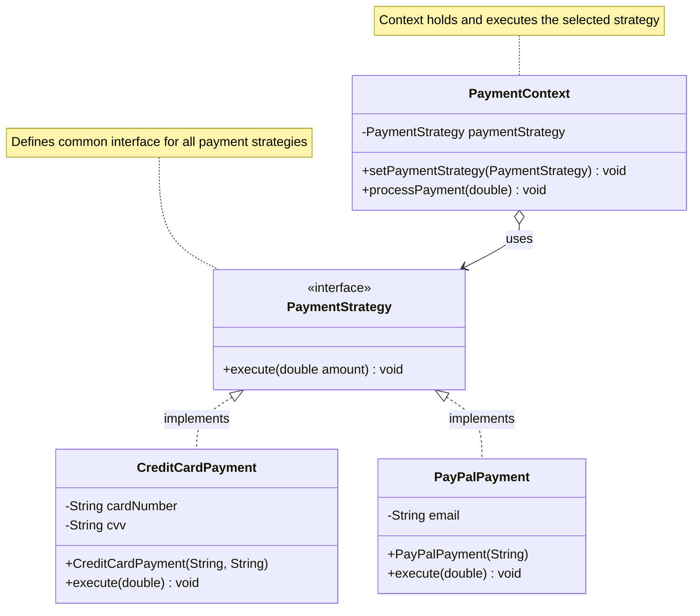
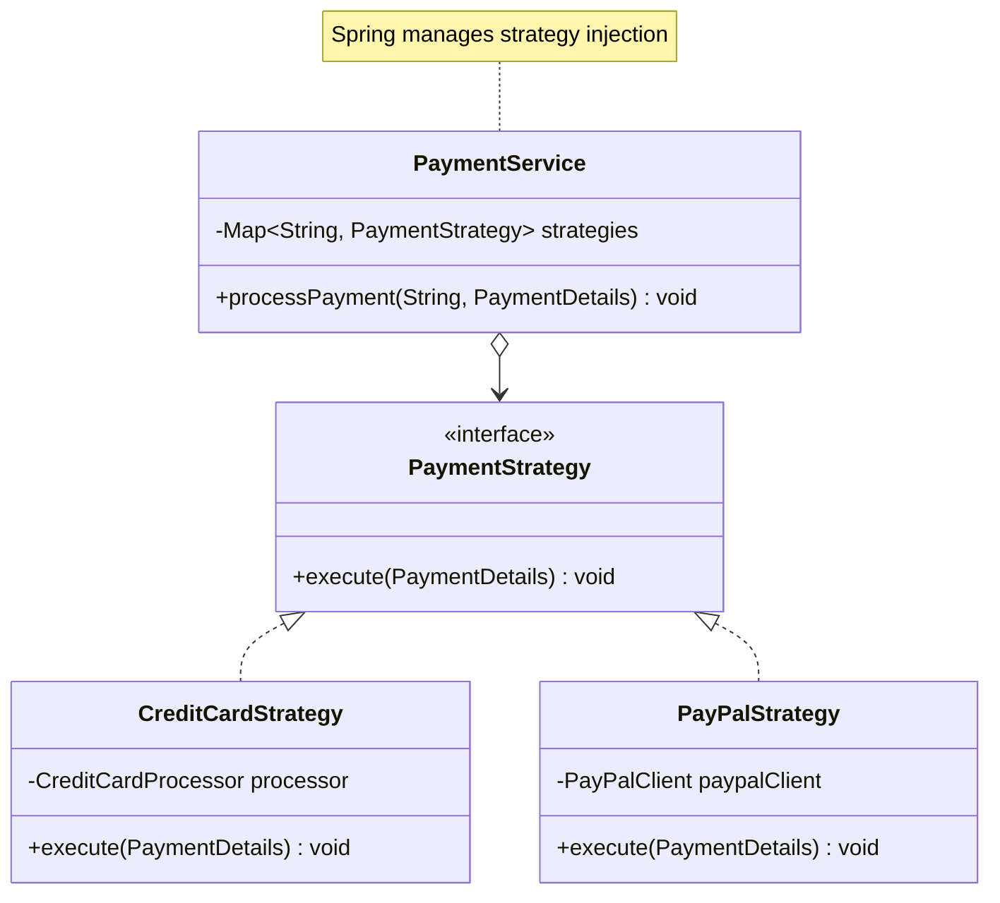

## Table of Contents
1. [Basic Strategy Pattern Concepts](#basic-concepts)
2. [Spring Integration](#spring-integration)
3. [Testing Strategy Components](#testing)
4. [Advanced Spring Features](#advanced-features)

<a name="basic-concepts"></a>
## 1. Basic Strategy Pattern Concepts

The Strategy pattern enables selecting an algorithm's implementation at runtime. Instead of implementing a single algorithm directly, code receives run-time instructions specifying which of a family of algorithms to use.

### Real-World Analogy

Think of payment processing in an e-commerce application. A customer might want to pay using:
- Credit Card
- PayPal
- Cryptocurrency
- Bank Transfer

Each payment method follows different rules but achieves the same goal: completing a payment.

### Basic Implementation

// The strategy interface that defines the common contract for all payment methods
```java title="PaymentStrategy.java"
/**
 * Strategy interface that defines the contract for all payment processing algorithms.
 * Each concrete payment method must implement this interface.
 */
public interface PaymentStrategy {
    /**
     * Executes the payment processing for the specified amount
     * @param amount The payment amount to process
     */
    void execute(double amount);
}
```

// Concrete strategy for credit card payments
```java title="CreditCardPayment.java"
/**
 * Concrete strategy implementation for processing credit card payments.
 * Handles credit card specific payment logic.
 */
public class CreditCardPayment implements PaymentStrategy {
    private String cardNumber;
    private String cvv;

    /**
     * Constructor requiring credit card details
     * @param cardNumber The credit card number
     * @param cvv The card's security code
     */
    public CreditCardPayment(String cardNumber, String cvv) {
        this.cardNumber = cardNumber;
        this.cvv = cvv;
    }

    @Override
    public void execute(double amount) {
        // In a real implementation, this would:
        // 1. Validate the credit card details
        // 2. Connect to a payment gateway
        // 3. Process the transaction
        // 4. Handle the response
        System.out.println("Paid " + amount + " using Credit Card");
    }
}
```

// Concrete strategy for PayPal payments
```java title="PayPalPayment.java"
/**
 * Concrete strategy implementation for processing PayPal payments.
 * Handles PayPal specific payment logic.
 */
public class PayPalPayment implements PaymentStrategy {
    private String email;

    /**
     * Constructor requiring PayPal account email
     * @param email The PayPal account email
     */
    public PayPalPayment(String email) {
        this.email = email;
    }

    @Override
    public void execute(double amount) {
        // In a real implementation, this would:
        // 1. Initialize PayPal client
        // 2. Create payment request
        // 3. Handle PayPal's response
        System.out.println("Paid " + amount + " using PayPal");
    }
}
```

// Context class that uses the payment strategies
```java title="PaymentContext.java"
/**
 * Context class that maintains a reference to the current payment strategy
 * and delegates the payment processing to it.
 */
public class PaymentContext {
    // The current payment strategy to be used
    private PaymentStrategy paymentStrategy;

    /**
     * Sets or changes the payment strategy at runtime
     * @param strategy The payment strategy to use
     */
    public void setPaymentStrategy(PaymentStrategy strategy) {
        this.paymentStrategy = strategy;
    }

    /**
     * Processes the payment using the current strategy
     * @param amount The amount to process
     */
    public void processPayment(double amount) {
        if (paymentStrategy == null) {
            throw new IllegalStateException("Payment strategy not set");
        }
        paymentStrategy.execute(amount);
    }
}
```

### Usage Example

```java title="PaymentExample.java"
/**
 * Example demonstrating how to use the payment strategy pattern
 */
public class PaymentExample {
    public static void main(String[] args) {
        // Create the context
        PaymentContext context = new PaymentContext();
        
        // Process a credit card payment
        context.setPaymentStrategy(new CreditCardPayment("1234-5678-9012-3456", "123"));
        context.processPayment(100.00);
        
        // Switch to PayPal payment
        context.setPaymentStrategy(new PayPalPayment("user@example.com"));
        context.processPayment(50.00);
    }
}
```

### Class Interaction Diagram



This class diagram shows:
- The `PaymentStrategy` interface that defines the contract for all payment strategies
- Concrete implementations (`CreditCardPayment` and `PayPalPayment`) that provide specific payment behaviors
- The `PaymentContext` class that maintains a reference to the current strategy and delegates payment processing to it
- The relationships between classes, including implementation and composition relationships

The diagram illustrates how:
1. The context class is decoupled from specific payment implementations
2. New payment strategies can be easily added by implementing the `PaymentStrategy` interface
3. Strategies can be switched at runtime through the `setPaymentStrategy` method

<a name="spring-integration"></a>
## 2. Spring Integration

Spring Framework enhances the Strategy pattern with:
- Automatic dependency injection
- Easy configuration management
- Component scanning
- Profile-based strategy selection
- AOP support

### Spring Implementation

// Base strategy interface with Spring integration
```java title="PaymentStrategy.java"
/**
 * Strategy interface for payment processing with Spring integration.
 * Annotated as a Spring service for component scanning.
 */
@Service
public interface PaymentStrategy {
    /**
     * Executes the payment processing with detailed payment information
     * @param details Contains all necessary payment details
     */
    void execute(PaymentDetails details);
}
```

// Credit card payment strategy implementation
```java title="CreditCardStrategy.java"
/**
 * Spring-managed credit card payment strategy.
 * Uses dependency injection for the credit card processor.
 */
@Service("creditCard")
public class CreditCardStrategy implements PaymentStrategy {
    // Inject the credit card processing service
    @Autowired
    private CreditCardProcessor processor;
    
    @Override
    public void execute(PaymentDetails details) {
        // Delegate payment processing to the injected processor
        processor.process(details);
    }
}
```

// PayPal payment strategy implementation
```java title="PayPalStrategy.java"
/**
 * Spring-managed PayPal payment strategy.
 * Uses dependency injection for the PayPal client.
 */
@Service("paypal")
public class PayPalStrategy implements PaymentStrategy {
    // Inject the PayPal client service
    @Autowired
    private PayPalClient paypalClient;
    
    @Override
    public void execute(PaymentDetails details) {
        // Delegate payment processing to the PayPal client
        paypalClient.processPayment(details);
    }
}
```

// Central payment service that manages all payment strategies
```java title="PaymentService.java"
/**
 * Central service that manages and executes payment strategies.
 * Automatically collects all payment strategy implementations through Spring.
 */
@Service
public class PaymentService {
    // Map of strategy names to their implementations
    private final Map<String, PaymentStrategy> strategies;

    /**
     * Constructor injection of all available payment strategies.
     * Spring automatically populates the map with all PaymentStrategy beans.
     * @param strategies Map of strategy names to implementations
     */
    @Autowired
    public PaymentService(Map<String, PaymentStrategy> strategies) {
        this.strategies = strategies;
    }

    /**
     * Process a payment using the specified strategy
     * @param strategyName Name of the strategy to use
     * @param details Payment details to process
     * @throws IllegalArgumentException if strategy name is invalid
     */
    public void processPayment(String strategyName, PaymentDetails details) {
        PaymentStrategy strategy = strategies.get(strategyName);
        if (strategy == null) {
            throw new IllegalArgumentException("Invalid payment strategy: " + strategyName);
        }
        strategy.execute(details);
    }
}
```
### Factory Pattern Integration

```java title="PaymentStrategyFactory.java"
/**
 * Factory class demonstrating how to combine the Strategy pattern
 * with the Factory pattern in a Spring context.
 */
@Component
public class PaymentStrategyFactory {
    private final ApplicationContext context;
    
    public SpringPaymentStrategy createStrategy(PaymentType type) {
        return switch (type) {
            case CREDIT_CARD -> context.getBean("creditCard", SpringPaymentStrategy.class);
            case PAYPAL -> context.getBean("paypal", SpringPaymentStrategy.class);
            default -> throw new IllegalArgumentException("Unknown payment type: " + type);
        };
    }
}
```

### Service Execution with Spring

// Base interface for service execution strategies
```java title="ServiceExecutionStrategy.java"
/**
 * Generic strategy interface for service execution.
 * Provides a common contract for different execution patterns.
 */
@Service
public interface ServiceExecutionStrategy {
    /**
     * Executes a service operation within a specific context
     * @param context The execution context containing necessary parameters
     * @return Result of the execution
     */
    Result execute(ServiceContext context);
}
```

// Asynchronous execution strategy implementation
```java title="AsyncServiceStrategy.java"
/**
 * Strategy implementation for asynchronous service execution.
 * Uses Spring's @Async capability for non-blocking operations.
 */
@Service("asyncService")
public class AsyncServiceStrategy implements ServiceExecutionStrategy {
    /**
     * Executes the service operation asynchronously
     * @param context The execution context
     * @return CompletableFuture containing the execution result
     */
    @Async
    @Override
    public Result execute(ServiceContext context) {
        return CompletableFuture.supplyAsync(() -> {
            // Asynchronous service logic
            return new Result(true, "Success", null);
        });
    }
}
```

// Retryable execution strategy implementation
```java title="RetryableServiceStrategy.java"
/**
 * Strategy implementation with retry capability.
 * Uses Spring Retry for automatic retry on failures.
 */
@Service("retryableService")
public class RetryableServiceStrategy implements ServiceExecutionStrategy {
    /**
     * Executes the service operation with retry capability
     * @param context The execution context
     * @return Result of the execution
     */
    @Retryable(
        value = { ServiceException.class },
        maxAttempts = 3,
        backoff = @Backoff(delay = 1000)
    )
    @Override
    public Result execute(ServiceContext context) {
        // Service logic with potential for retry
        return new Result(true, "Success", null);
    }
}
```

// Configuration for service execution strategies
```java title="ServiceExecutionConfig.java"
/**
 * Configuration class for service execution strategies.
 * Sets up async execution and retry capabilities.
 */
@Configuration
@EnableAsync
@EnableRetry
public class ServiceExecutionConfig {
    /**
     * Configures the async executor for @Async operations
     */
    @Bean
    public AsyncConfigurer asyncConfigurer() {
        return new AsyncConfigurer() {
            @Override
            public Executor getAsyncExecutor() {
                ThreadPoolTaskExecutor executor = new ThreadPoolTaskExecutor();
                executor.setCorePoolSize(5);
                executor.setMaxPoolSize(10);
                executor.setQueueCapacity(25);
                executor.initialize();
                return executor;
            }
        };
    }
    
    /**
     * Configures the retry template for @Retryable operations
     */
    @Bean
    public RetryTemplate retryTemplate() {
        RetryTemplate retryTemplate = new RetryTemplate();
        
        // Configure backoff policy
        FixedBackOffPolicy fixedBackOffPolicy = new FixedBackOffPolicy();
        fixedBackOffPolicy.setBackOffPeriod(2000l);
        
        // Configure retry policy
        SimpleRetryPolicy retryPolicy = new SimpleRetryPolicy();
        retryPolicy.setMaxAttempts(3);
        
        retryTemplate.setBackOffPolicy(fixedBackOffPolicy);
        retryTemplate.setRetryPolicy(retryPolicy);
        
        return retryTemplate;
    }
}
```
<a name="testing"></a>
## 3. Testing Strategy Components

### Unit Testing

```java title="Payment Strategy Tests"
@SpringBootTest
class PaymentStrategyTest {
    @MockBean
    private CreditCardProcessor creditCardProcessor;
    
    @Autowired
    private CreditCardStrategy creditCardStrategy;
    
    @Test
    void testCreditCardPayment() {
        PaymentDetails details = new PaymentDetails("4111-1111-1111-1111", 100.00);
        creditCardStrategy.execute(details);
        verify(creditCardProcessor, times(1)).process(details);
    }
}

@SpringBootTest
class ServiceExecutorTest {
    @MockBean
    private ServiceStrategyFactory strategyFactory;
    
    @Mock
    private ServiceExecutionStrategy mockStrategy;
    
    @Autowired
    private SpringServiceExecutor serviceExecutor;
    
    @Test
    void testStrategyExecution() {
        ServiceContext context = new ServiceContext();
        when(strategyFactory.getStrategy("test")).thenReturn(mockStrategy);
        when(mockStrategy.execute(any())).thenReturn(new Result(true, "Success", null));
        
        Result result = serviceExecutor.executeService("test", context);
        
        assertTrue(result.isSuccess());
        verify(mockStrategy, times(1)).execute(context);
    }
}
```

### Integration Testing

```java title="Service Integration Tests"
@SpringBootTest
@AutoConfigureMockMvc
class ServiceExecutionIntegrationTest {
    @Autowired
    private MockMvc mockMvc;
    
    @Test
    void testServiceEndpoint() throws Exception {
        ServiceContext context = new ServiceContext();
        String json = new ObjectMapper().writeValueAsString(context);
        
        mockMvc.perform(post("/api/services/async")
                .contentType(MediaType.APPLICATION_JSON)
                .content(json))
                .andExpect(status().isOk())
                .andExpect(jsonPath("$.success").value(true));
    }
}
```

<a name="advanced-features"></a>
## 4. Advanced Spring Features

### Caching Support

```java title="Caching Configuration and Strategy"
@Configuration
@EnableCaching
public class CachingConfig {
    @Bean
    public CacheManager cacheManager() {
        SimpleCacheManager cacheManager = new SimpleCacheManager();
        cacheManager.setCaches(Arrays.asList(
            new ConcurrentMapCache("strategyResults")
        ));
        return cacheManager;
    }
}

@Service("cachingStrategy")
public class CachingServiceStrategy implements ServiceExecutionStrategy {
    
    @Cacheable(value = "strategyResults", key = "#context.serviceId")
    @Override
    public Result execute(ServiceContext context) {
        return computeExpensiveResult(context);
    }
}
```

### Event-Driven Architecture

```java title="Event-Driven Service Components"
// Custom Events
public class ServiceExecutionEvent extends ApplicationEvent {
    private final String strategyType;
    private final ServiceContext context;
    
    public ServiceExecutionEvent(Object source, String strategyType, ServiceContext context) {
        super(source);
        this.strategyType = strategyType;
        this.context = context;
    }
}

@Service
public class EventDrivenServiceExecutor {
    private final ServiceStrategyFactory strategyFactory;
    private final ApplicationEventPublisher eventPublisher;
    
    @Autowired
    public EventDrivenServiceExecutor(
            ServiceStrategyFactory strategyFactory,
            ApplicationEventPublisher eventPublisher) {
        this.strategyFactory = strategyFactory;
        this.eventPublisher = eventPublisher;
    }
    
    public void executeService(String strategyType, ServiceContext context) {
        eventPublisher.publishEvent(new ServiceExecutionEvent(this, strategyType, context));
        ServiceExecutionStrategy strategy = strategyFactory.getStrategy(strategyType);
        Result result = strategy.execute(context);
        eventPublisher.publishEvent(new ServiceCompletionEvent(this, result));
    }
}
```

### Metrics and Monitoring

```java title="Service Execution Metrics Aspect"
@Component
@Aspect
public class ServiceExecutionMetrics {
    private final MeterRegistry meterRegistry;
    
    @Autowired
    public ServiceExecutionMetrics(MeterRegistry meterRegistry) {
        this.meterRegistry = meterRegistry;
    }
    
    @Around("execution(* com.example.service.ServiceExecutionStrategy.execute(..))")
    public Object measureExecutionTime(ProceedingJoinPoint joinPoint) throws Throwable {
        Timer.Sample sample = Timer.start(meterRegistry);
        
        try {
            Object result = joinPoint.proceed();
            sample.stop(Timer.builder("service.execution")
                    .tag("strategy", joinPoint.getTarget().getClass().getSimpleName())
                    .tag("status", "success")
                    .register(meterRegistry));
            return result;
        } catch (Exception e) {
            sample.stop(Timer.builder("service.execution")
                    .tag("strategy", joinPoint.getTarget().getClass().getSimpleName())
                    .tag("status", "error")
                    .register(meterRegistry));
            throw e;
        }
    }
}
```

### Configuration Properties

```yaml title="application.yml"
# application.yml
service:
  execution:
    cache:
      enabled: true
      ttl: 3600
    metrics:
      enabled: true
    events:
      async: true
      thread-pool:
        core-size: 5
        max-size: 10
    strategies:
      retry:
        max-attempts: 3
        backoff:
          initial: 1000
          multiplier: 2
      cache:
        size: 1000
        eviction: LRU
```

### Class Diagram



The diagram above illustrates the key components:
- `PaymentStrategy` interface defines the contract
- Concrete strategies (`CreditCardStrategy`, `PayPalStrategy`) implement the interface
- `PaymentService` uses the strategies through dependency injection
- Spring Framework manages the instantiation and injection of appropriate strategies

## Best Practices and Recommendations

1. **Dependency Injection**
    - Use constructor injection for required dependencies
    - Avoid field injection
    - Keep dependencies minimal and focused

2. **Configuration Management**
    - Use application.properties/yml for strategy configuration
    - Leverage Spring profiles for environment-specific strategies
    - Externalize sensitive configuration

3. **Testing**
    - Write unit tests for each strategy
    - Include integration tests for the complete flow
    - Use Spring's testing support tools

4. **Monitoring and Maintenance**
    - Implement comprehensive logging
    - Add metrics for performance monitoring
    - Use Spring actuator for health checks

5. **Error Handling**
    - Implement proper exception handling
    - Use Spring's exception handling mechanisms
    - Provide meaningful error messages

6. **Performance**
    - Use caching where appropriate
    - Implement async processing for long-running tasks
    - Monitor and optimize resource usage