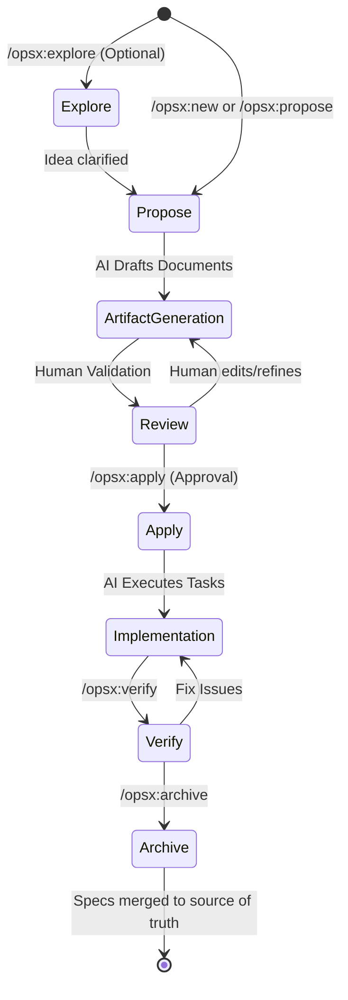

---
title: "Mastering Spec-Driven Development: Integrating OpenSpec with GitHub Copilot in VS Code"
subtitle: "Anchor Copilot to a Deterministic Plan with Delta Specs, Task Checklists, and CodeLens Execution"
excerpt: "A deep analysis of the OpenSpec framework - its planning artefacts, VS Code and GitHub Copilot integration mechanics, custom schemas, and the operational boundaries that decide whether spec-driven development pays for itself."
date: 2026-08-19
author: "Abu Dhahir"
tags: ["OpenSpec", "GitHub Copilot", "VS Code", "spec-driven development", "agentic AI"]
draft: false
---


**Table of Contents**

1.  The Paradigm Shift: From Ad-Hoc Prompting to Structured Development

2.  Deconstructing the OpenSpec Framework Architecture

3.  The Anatomy of Planning and Execution Artifacts

4.  VS Code and GitHub Copilot Integration Mechanics

5.  Visualizing the Workflow: Dashboards and Extensions

6.  Guided Example: Modernizing a Brownfield Application

7.  Custom Schemas and Advanced Agent Orchestration

8.  When to Use OpenSpec

9.  What OpenSpec is Not

10.  Areas Needing More Attention When Using OpenSpec

11.  Effectiveness and Engineering ROI

12.  Conclusion

### The Paradigm Shift: From Ad-Hoc Prompting to Structured Development

The introduction of Large Language Models (LLMs) into software engineering initially popularized a workflow colloquially known as "vibe coding." This approach relies on iterative, chat-based prompting where a developer asks an AI assistant to write or modify code, often without a predefined architectural plan. While this method is highly effective for rapid prototyping, generating boilerplate, or writing isolated scripts, it scales poorly in complex, enterprise-grade applications.   

As project complexity increases, the AI agent's context window fills with fragmented conversation history. This leads to degraded performance, hallucinations, and a phenomenon where the model forgets or alters earlier requirements. Research indicates that when context usage exceeds forty percent, AI performance degrades significantly. Without a single source of truth, developers spend excessive time repeatedly prompting the AI to correct architectural drift.   

Spec-Driven Development (SDD) emerges as the natural maturation of AI-assisted engineering. Instead of writing code first and attempting to document or test it later, SDD mandates that the human developer and the AI agree on a formal specification before any code execution occurs. This written contract becomes the centralized source of truth. It guides the generation, testing, and validation of the implementation.   

OpenSpec is an open-source SDD framework created by Fission AI that facilitates this exact process. By leveraging structured Markdown files that map out proposals, designs, specifications, and tasks, OpenSpec anchors the AI to a deterministic plan. This ensures that subsequent code generation aligns perfectly with human intent, significantly reducing the guesswork and unpredictability inherent in standard chat interfaces.   

### Deconstructing the OpenSpec Framework Architecture

OpenSpec operates on a philosophy that is fluid rather than rigid, iterative rather than waterfall, and explicitly designed for brownfield (existing) codebases. The framework manages feature requests and bug fixes as isolated modifications, akin to Git branches. These isolated modifications are stored in a dedicated `openspec/changes/` directory within the project repository.   

This file-system-based approach requires no complex databases or heavy Python installations. It relies purely on plain text Markdown files that can be easily version-controlled alongside the source code. Setting up the framework requires Node.js and is initiated via a simple global installation command (`npm install -g @fission-ai/openspec@latest`), followed by running `openspec init` in the project root.   

The OpenSpec CLI provides the core state machine that tracks the lifecycle of a change. The framework utilizes specific slash commands that interface with AI coding agents like GitHub Copilot. By default, OpenSpec configures a core profile that includes standard workflows.   

| **Command Profile** | **Slash Command** | **Primary Function** |
| --- |  --- |  --- |
| **Core** | `/opsx:explore` | Analyzes code and weighs options without generating artifacts. |
| --- |  --- |  --- |
| **Core** | `/opsx:propose` | Generates the change folder and all planning documents. |
| **Core** | `/opsx:apply` | Directs the AI to execute the implementation checklist. |
| **Core** | `/opsx:archive` | Merges specs and moves the change to the archive folder. |
| **Expanded** | `/opsx:ff` | Fast-forwards through artifact generation automatically. |
| **Expanded** | `/opsx:continue` | Steps through artifact generation sequentially for manual review. |

  

The standard workflow cycle operates as a continuous loop. It begins with an optional exploration phase where the AI acts as a low-stakes thinking partner, evaluating existing code and shaping an approach. Once the approach is clear, the proposal phase generates the artifacts. The developer reviews these artifacts, the AI applies the changes to the codebase, and finally, the change is archived, updating the master specifications.   

Code snippet



### The Anatomy of Planning and Execution Artifacts

When a new change is initialized, OpenSpec generates a specific directory structure. This structure typically contains four primary artifacts. Each artifact serves a highly distinct purpose, carefully segregating the business intent, the behavioral requirements, the technical architecture, and the execution steps.   

#### The Proposal Document (`proposal.md`)

The `proposal.md` file defines the business intent and the scope of the modification. It answers why the change is necessary and outlines the high-level goals and explicitly stated non-goals. This document ensures that the AI understands the broader product context before diving into technical minutiae. Establishing clear boundaries prevents the AI from over-engineering solutions or modifying unrelated systems.   

#### The Specifications Directory (`specs/`)

The `specs/` directory houses the behavioral requirements of the system. OpenSpec advocates for writing requirements using EARS-style (Easy Approach to Requirements Syntax) phrasing. This involves utilizing strict keywords like SHALL, MUST, or SHOULD to define system obligations.   

These requirements are further solidified through concrete scenarios written in Behavior-Driven Development (BDD) syntax. BDD syntax uses strict clauses to define state and action:   

-   **GIVEN:** The initial context or state of the system.

-   **WHEN:** The specific action or event that occurs.

-   **THEN:** The expected outcome or resulting state.   

Because OpenSpec prioritizes brownfield development, it utilizes a concept called "Delta Specs" during the proposal phase. Instead of rewriting an entire system specification from scratch, the AI drafts only the specific changes using dedicated markdown headers.   

| **Delta Header** | **Usage Scenario** | **Architectural Impact** |
| --- |  --- |  --- |
| `## ADDED` | Introduces a completely new capability or sub-capability. | Used when the change is orthogonal to existing features. |
| --- |  --- |  --- |
| `## MODIFIED` | Changes the behavior or acceptance criteria of an existing requirement. | Requires pasting the full, updated requirement content to replace the old one. |
| `## REMOVED` | Deletes a feature or capability from the system. | Ensures legacy code is safely excised from the master specification. |
| `## RENAMED` | Alters the naming convention without changing underlying behavior. | Keeps terminology consistent across evolving domains. |

  

#### The Technical Design (`design.md`)

The `design.md` file captures the technical architecture, database schema modifications, and specific library choices. It explicitly separates implementation details from the behavioral specifications. Keeping the `specs/` directory focused purely on observable behavior ensures that the specifications remain durable even if the underlying technology stack is refactored. The design document acts as the technical bridge between the behavioral goals and the code.   

#### The Implementation Checklist (`tasks.md`)

The `tasks.md` file serves as the atomic, numbered implementation checklist. This checklist breaks down the proposed technical design into sequentially executable chunks. Grouped under logical hierarchical headings (e.g., `1.1`, `1.2`, `2.1`), these tasks provide the AI agent with a strict, linear path to follow during the coding phase.   

### VS Code and GitHub Copilot Integration Mechanics

The true power of OpenSpec is realized when it is integrated tightly into an Integrated Development Environment (IDE) like Visual Studio Code, paired with a robust AI assistant like GitHub Copilot. While OpenSpec is fundamentally a terminal-based CLI tool, the ecosystem surrounding it provides rich visual and operational integrations.   

#### The Agent Tool-Calling Loop

To understand the integration, one must understand how VS Code handles AI agents. When a developer uses an agent like GitHub Copilot in VS Code, a sophisticated tool-calling loop occurs. This is a continuous "think, act, observe, think again" cycle.   

On each iteration, the agent harness builds a prompt combining the system instructions, the workspace context, the conversation history, and the results of any previously called tools. The agent sends this prompt to the underlying model. If the model determines it needs more information or needs to modify a file, it issues a tool call. The VS Code harness executes this tool, captures the output, and feeds it back into the loop. This allows the AI to search files, read code, edit files, and run tests autonomously until it decides the task is complete.   

#### CodeLens Task Execution

The "OpenSpec for Copilot" and similar task execution extensions leverage this agent loop directly through the IDE interface. A transformative feature is the implementation of CodeLens actions directly within the `tasks.md` file.   

When a developer opens a generated task list, a "Start Task" or "Run entire phase" button appears natively above the Markdown checkboxes. Clicking this button bypasses the need to manually copy and paste context into a chat window. The extension automatically compiles the exact context required for that specific task. This injected context includes the project conventions (`project.md`), the change proposal, the technical design, the delta specs, the status of previous tasks, and the specific current task to implement.   

Code snippet

```Mermaid
sequenceDiagram
    participant Dev as Developer
    participant VSCode as VS Code (CodeLens)
    participant Ext as OpenSpec Extension
    participant Copilot as GitHub Copilot Chat

    Dev->>VSCode: Opens `tasks.md` file
    VSCode-->>Dev: Displays "Start Task" button above `[ ] 1.1`
    Dev->>VSCode: Clicks "Start Task"
    VSCode->>Ext: Trigger Task Execution Event
    Ext->>Ext: Compile Context (Proposal, Design, Specs, Task)
    Ext->>Copilot: Send compiled payload as hidden prompt
    Copilot->>Copilot: Execute Tool Calling Loop (Think -> Act -> Observe)
    Copilot-->>Dev: Generates Code & Edits Files
    Dev->>VSCode: Reviews Diff in Editor
    Dev->>VSCode: Checks off Markdown checkbox `[x] 1.1`

```

This workflow minimizes context switching. The developer remains in the editor, treating the AI as an executor of highly specific, context-rich commands rather than an open-ended conversational partner.   

### Visualizing the Workflow: Dashboards and Extensions

Reading raw Markdown files across a massive repository can induce cognitive overload, especially when multiple changes are in flight simultaneously. To mitigate this, the community has developed visual extensions that turn the `openspec/` directory into a navigable user interface within VS Code.   

#### Read-Only Viewers and BDD Highlighting

Tools like the `spek` viewer provide a structured browsing experience directly in the VS Code Activity Bar. These extensions are strictly local and read-only, ensuring that no proprietary data leaves the developer's machine.   

A core feature of these viewers is BDD syntax highlighting. The interface visually distinguishes GIVEN, WHEN, and THEN clauses, and provides distinct badges for delta operations (ADDED, MODIFIED, REMOVED). Furthermore, these extensions parse the checkboxes in the `tasks.md` files to render section-grouped progress bars, giving developers an immediate visual indicator of task completion rates.   

#### Gantt Charts and Worktree Aggregation

In advanced AI-agent scenarios, a single repository might have several working copies checked out simultaneously. Each autonomous agent or parallel human track might operate on its own branch within its own Git worktree. The changes for that work scatter across those isolated copies.   

Visual extensions aggregate these in-flight changes. By parsing the `git worktree list`, the dashboard can pull all active OpenSpec changes into a single, unified view. These changes are often displayed on a horizontal Gantt-style timeline, showing creation dates, active durations, and archive dates, providing engineering managers with a holistic view of the project's state without requiring manual terminal inspections.   

#### The OpenSpec UI Workbench

For developers requiring write access and lifecycle controls from a UI, the OpenSpec Workbench brings the complete change workflow into VS Code. This extension allows users to navigate configurations, view active and archived changes, and edit proposals and delta specs in native markdown editors.   

Crucially, the Workbench introduces persistent processes and checkpoints. If an AI agent's implementation run goes awry, the developer can trigger a conflict-safe rollback. The system reverts only the files mutated during that specific run. It refuses to overwrite manual edits made by the human developer after the run, ensuring that rollbacks are safe and predictable.   

### Guided Example: Modernizing a Brownfield Application

To understand the practical application of this framework, consider a detailed example based on real-world modernization patterns. A team needs to add multi-currency settlement support to an existing payment processing platform. Currently, the legacy system settles everything in the merchant's home currency, but new regulations require supporting European merchants who need EUR settlement even when the cardholder pays in GBP.   

**Phase 1: Exploration and Context Gathering** The requirements are complex and cross-reference older business analyst documents. The developer starts with an exploration phase to ensure the AI understands the legacy batch architecture. The developer types in the Copilot Chat: `/opsx:explore We need to support multi-currency settlement. Analyze the existing codebase to see if our current batch architecture can handle currency grouping.`

\[cite: 25\]

The AI analyzes the repository, identifies integration points, and flags technical decisions needed regarding foreign exchange rate locking. No files are generated yet; this is purely strategic alignment.   

**Phase 2: Proposing the Change** With a clear strategy, the developer initializes the change structure. Command: `/opsx:new add-multi-currency-settlement`

\[cite: 25\]

OpenSpec creates the isolated directory: `openspec/changes/add-multi-currency-settlement/`. To save time, the developer fast-forwards through artifact generation: `/opsx:ff`. Copilot generates the `proposal.md`, a `specs/` directory, `design.md`, and `tasks.md`.   

**Phase 3: Human Review and Refinement** The developer opens the generated artifacts. The `design.md` proposes fetching exchange rates at the exact time of settlement. However, the developer knows business rules require locking the rate at authorization. The developer pushes back via chat: *"The design proposes fetching rates at settlement. We must lock the rate at authorization and store it on the transaction record. Update the design."* Copilot updates the markdown files to reflect this architectural constraint. The developer also reviews the Delta Specs, ensuring a `## MODIFIED Requirement` block accurately details the new dual-currency settlement file format.   

**Phase 4: Task Implementation** With the artifacts approved, the developer opens the `tasks.md` file. It contains a numbered list:`[ ] 1.1 Add fx_rate and settlement_currency to transactions schema``[ ] 1.2 Create FX rate locking module with gateway adapter``[ ] 2.1 Modify settlement batch builder for multi-currency grouping`

\[cite: 25\]

Using the VS Code extension, the developer clicks the "Start Task" CodeLens above task 1.1. Copilot reads the exact schema constraints from `design.md` and modifies the database migration files autonomously. The developer reviews the diff, accepts it, and manually checks the markdown box `[x] 1.1`. This process repeats sequentially.   

**Phase 5: Verification and Archival** Once all tasks are checked, the developer runs a verification step: `/opsx:verify`. The AI checks its own implementation against the original artifacts, ensuring all requirements were covered and design patterns were followed. Finally, the developer executes `/opsx:archive`. OpenSpec merges the Delta Specs into the master `openspec/specs/` directory and moves the change folder to `openspec/changes/archive/2026-02-24-add-multi-currency-settlement/`. The master specification is now fully up to date with the legacy system's new capabilities.   

### Custom Schemas and Advanced Agent Orchestration

OpenSpec is not rigidly bound to the default proposal, spec, design, and task sequence. It supports custom schemas defined via a `schema.yaml` file, allowing organizations to mold the framework to their specific operational procedures. OpenSpec resolves these schemas hierarchically, prioritizing project-level configurations over global user-level defaults.   

| **Schema Name** | **Target Use Case** | **Generated Artifact Flow** |
| --- |  --- |  --- |
| **spec-driven** (Default) | Standard feature development. | `proposal.md` → `specs.md` → `design.md` → `tasks.md`. |
| --- |  --- |  --- |
| **minimalist** | Low-risk, well-scoped, trivial changes. | `specs.md` → `tasks.md` (Skips proposal/design). |
| **event-driven** | Asynchronous messaging systems. | Event storming (Mermaid diagrams) → `specs.md` → `design.md` → AsyncAPI schema → `tasks.md`. |
| **spec-driven-with-adr** | Systems requiring rigorous audit trails. | Proposal → Specs → Architectural Decision Record (ADR) → Tasks. |

  

The ability to define custom schemas is vital for advanced architectural patterns. For example, the `spec-driven-with-adr` schema introduces Architectural Decision Records that live alongside the source of truth spec. Specs capture the state of functionality, while ADRs capture the state of architecture---the context, options, choices, and consequences behind every significant technical decision. Because ADRs persist after a change is archived, future AI sessions can leverage prior reasoning, preventing the model from suggesting architectural patterns that the team previously rejected.   

#### Multi-Agent Orchestration

For massive projects, context window limitations make single-agent approaches unviable. Spec-driven frameworks enable sophisticated multi-agent orchestration. A coordinator agent can act as the product manager, taking a high-level goal and using OpenSpec to generate the proposal and task lists.   

Once the `tasks.md` is generated, the coordinator distributes individual tasks to parallel implementor sub-agents. Because all work is managed in Git worktrees, these sub-agents can execute their code generation simultaneously without stepping on each other's toes or causing file conflicts. Finally, a separate verifier agent independently checks the output of each worktree against the original specification criteria before merging.   

### When to Use OpenSpec

Determining the appropriate context for deploying OpenSpec is critical for maximizing its utility. The framework introduces upfront friction designed to prevent downstream catastrophe. It is exceptionally potent in specific operational environments.

#### Brownfield Codebase Modernization

The primary domain where OpenSpec vastly outperforms alternatives like GitHub Spec Kit is in brownfield development. Brownfield projects are legacy codebases that lack test coverage or formal specifications. Attempting to generate a comprehensive, massive specification for a legacy system upfront is often a futile exercise; AI models hallucinate and fail to capture historical compromises embedded in the code.   

OpenSpec solves this through targeted incrementalism. Developers only write specs for the specific slice of the system they are currently modifying via Delta Specs. Over time, as changes accumulate and are archived, the specification density grows organically in the most frequently touched areas of the application. The coverage builds naturally where it matters most, allowing teams to modernize legacy code safely.   

#### Cross-Repository and Platform Team Architectures

In enterprise environments, a single feature often spans multiple repositories---requiring backend API modifications, frontend UI updates, and adjustments to shared utility libraries. Managing documentation across these boundaries is notoriously difficult.   

OpenSpec accommodates this through its "Stores" concept. Stores allow teams to maintain the planning artifacts and specifications in a centralized, dedicated repository, separate from the actual code repos. This enables a platform architecture team to own the master specifications as a single source of truth. Product teams can then reference these read-only specs across various codebases, ensuring that different microservices align with the overarching behavioral contract.   

#### Regulated Environments and Compliance

Organizations operating in highly regulated sectors (e.g., finance, healthcare) require strict audit trails. Traditional vibe coding leaves no record of why a technical decision was made, only the resulting code. OpenSpec inherently generates an audit trail. Because changes are merged into archive folders (`openspec/changes/archive/`), compliance officers and security teams can review the historical lineage of every feature. They can trace a specific line of code back to the `tasks.md` item, which points to the `design.md` constraints, which justifies the business intent in the `proposal.md`.   

### What OpenSpec is Not

To effectively integrate this framework into a team's culture, developers must clearly understand its boundaries and inherent limitations. Misinterpreting the purpose of OpenSpec leads to suboptimal workflows and diminished engineering velocity.

**It is Not a Rigid Waterfall Methodology** Despite relying on upfront planning, OpenSpec explicitly rejects the rigidity of traditional Waterfall software development. In a Waterfall model, passing a phase gate locks the previous documents; if requirements change during implementation, updating the documentation requires immense bureaucratic overhead. OpenSpec, conversely, encourages fluid iteration. If a developer discovers an architectural flaw or a blocked dependency during the task implementation phase, they are actively encouraged to modify the `design.md` and `specs.md` artifacts dynamically. The framework acknowledges that understanding deepens during the act of coding.   

**It is Not a Replacement for Automated Testing** While OpenSpec utilizes Behavior-Driven Development syntax (GIVEN/WHEN/THEN) to define behavioral scenarios, these markdown files are not executable test suites. They serve as the *blueprint* for tests. A robust workflow requires the AI to read the scenarios in the spec and subsequently generate the corresponding unit, integration, or end-to-end tests in the actual testing framework (e.g., Jest, Cypress, PyTest). OpenSpec aligns human intent with AI generation; it does not replace the CI/CD pipeline's role in verifying code execution through automated test runners.   

**It is Not Efficient for Trivial Aesthetic Changes** For highly visual, experimental, or trivial changes---such as tweaking a CSS layout to "look more premium" or updating a single button color---the overhead of generating a proposal, design, and delta spec is burdensome and counterproductive. Some developers have noted that for purely aesthetic UI redesigns, a simple `Instructions.md` file paired with standard vibe coding yields faster and cheaper results than a strict SDD pipeline. OpenSpec provides structural rigor; applying that rigor to tasks that require zero structural planning is an anti-pattern that bloats token costs and slows development.   

**It is Not a Vendor-Locked Ecosystem** Unlike proprietary solutions such as AWS Kiro, which restricts users to specific IDEs and specific models (e.g., Claude), OpenSpec is strictly tool-agnostic. It operates with over twenty different AI coding assistants, including GitHub Copilot, Cursor, RooCode, and Amazon Q. Because the artifacts are standard Markdown files stored locally, the team retains ownership of their specifications regardless of which AI model or editor they migrate to in the future.   

### Areas Needing More Attention When Using OpenSpec

Adopting Spec-Driven Development requires a fundamental shift in engineering habits. Teams transitioning from ad-hoc prompting to OpenSpec often stumble in a few predictable areas. Heightened attention to the following pitfalls is necessary for sustained success.

#### Preventing Spec Sprawl and "Junk Drawers"

A critical failure mode in OpenSpec usage is neglecting the archive phase. Developers often create proposals, implement the tasks, merge the code via a Pull Request, and immediately move on to the next feature. Consequently, the `openspec/changes/` directory becomes a cluttered "junk drawer" filled with dozens of stale feature folders. Nobody on the team knows which folders represent active work and which represent completed, deployed features.   

Archiving is not an optional housekeeping task; it is the fundamental mechanism that updates the source of truth. Unarchived changes represent immediate technical debt. Best practices dictate that archiving (`/opsx:archive`) should be integrated tightly into the definition of "done." Advanced teams configure their CI/CD pipelines to enforce this, automatically failing a build if a merged Pull Request leaves unarchived folders in the `changes/` directory.   

#### Enforcing the Boundary Between Behavior and Implementation

A common anti-pattern involves polluting the behavioral specifications with dense implementation details. Developers or AI agents might draft a spec that reads: "The system SHALL use `bcrypt.compare()` with salt rounds of 12 and store the hash in the `users.password_hash` column using VARCHAR(255)".   

This is fundamentally incorrect. Specs must describe observable system behavior, not the underlying mechanics. Over-specifying constrains the AI unnecessarily and transforms the specification into a fragile document that breaks the moment the database schema is refactored. The correct approach isolates the behavior in the spec ("The system SHALL store passwords using industry-standard one-way hashing") and relegates the specific library and schema decisions exclusively to the `design.md` file.   

#### The Absolute Necessity of the Human Review Phase

The allure of AI automation often tempts developers to execute the entire lifecycle autonomously: generating the proposal, skipping the reading phase, and immediately running the task implementation. This blind trust negates the entire purpose of Spec-Driven Development.   

The initial artifacts generated by the AI are merely drafts. The AI lacks inherent knowledge of subtle business edge cases, unwritten team naming conventions, or undocumented API quirks. The review phase is where human expertise is injected. Developers must read the `proposal.md` and spec deltas, iterating on them multiple times with the AI to refine the boundaries before any code is generated. Treating the planning phase as a collaborative writing exercise guarantees that the subsequent implementation phase requires minimal manual rework.   

#### Context Window Hygiene and Chunking

While OpenSpec inherently manages context better than vibe coding, developers must still practice active context hygiene. Providing an AI with a massive, monolithic spec document spanning thousands of lines will degrade its reasoning capabilities rapidly. Specification chunking is strictly required; large specifications must be broken into logical, capability-based sections. When executing a task, only the relevant delta specs and the specific architectural constraints should be loaded into the Copilot context window, ensuring the model remains sharply focused on the immediate problem space without hallucinating details from unrelated systems.   

### Effectiveness and Engineering ROI

Evaluating the effectiveness of OpenSpec requires looking beyond raw lines of code generated per minute. The true Return on Investment (ROI) of Spec-Driven Development is measured in architectural alignment, predictability, and cognitive load reduction.   

**Predictability and Quality of AI Output** By forcing the AI to articulate a plan in plain English before writing syntax, OpenSpec drastically reduces the frequency of logical hallucinations. Developers can identify architectural misalignments in a Markdown file in seconds, whereas finding the same architectural flaw buried in hundreds of lines of generated code could take hours of debugging. This predictable alignment ensures that the output generated during the `/opsx:apply` phase compiles and integrates with significantly higher success rates than ad-hoc vibe coding.   

**Cognitive Offloading for Developers** Software engineering requires holding massive amounts of state in short-term memory. OpenSpec acts as a persistent external memory drive for the developer's intent. Because specifications live alongside the code in the repository, a developer can context-switch to a critical production bug, return to their feature branch three days later, and immediately resume work. The AI simply re-reads the `tasks.md` and `specs/` files, seamlessly picking up exactly where the session left off without the developer needing to meticulously re-prompt the history of the conversation.   

**Conflict-Safe Rollbacks and Execution Safety** Modern UI integrations, such as the OpenSpec Workbench for VS Code, enhance effectiveness by introducing persistent process checkpoints. Because the agent's work is guided by atomic tasks, if an implementation step goes awry, the developer can trigger a conflict-safe rollback. The system reverts only the files mutated during that specific run, refusing to overwrite manual edits made elsewhere, and provides transparent disclosures of the rollback scope. This granular, state-driven control provides a safety net that encourages ambitious refactoring.   

**Asynchronous Collaboration and Onboarding** From a team dynamics perspective, the artifact trail left by OpenSpec is invaluable. Pull requests are no longer just opaque diffs of code; they are accompanied by a clear `proposal.md` explaining the *why* and spec deltas proving the *what*. This allows senior engineers to review the architectural intent asynchronously, often catching conceptual errors before the code is even fully drafted. Furthermore, new engineers onboarding onto a legacy project can read the archived OpenSpec changes to understand exactly how and why the system evolved over time, drastically reducing ramp-up periods and accelerating time-to-productivity.   

### Conclusion

The integration of OpenSpec with GitHub Copilot in Visual Studio Code represents a critical maturation in the era of generative AI engineering. Moving beyond the chaotic unpredictability of ad-hoc vibe coding, Spec-Driven Development provides the structural rigor necessary to build, maintain, and safely modernize complex software systems.

By demanding upfront alignment on intent, separating behavioral requirements from technical implementation, and providing a deterministic, task-based checklist for AI agents to follow, OpenSpec transforms Copilot from a reactive autocomplete tool into an autonomous, yet strictly governed, engineering collaborator. Its file-system-native architecture, custom schemas, and profound synergy with brownfield codebases ensure it acts as a lightweight enabler rather than a bureaucratic bottleneck. For engineering teams seeking to harness the speed of AI without sacrificing the architectural integrity of their platforms, adopting structured methodologies like OpenSpec is not merely an optimization---it is an operational imperative.

---

## Sources

- [Vibe Coding vs Spec-Driven Development: Why One Scales](https://www.mindstudio.ai/blog/vibe-coding-vs-spec-driven-development) — mindstudio.ai
- [Vibe coding or spec-driven development? How to choose](https://www.infoworld.com/article/4166817/vibe-coding-or-spec-driven-development-how-to-choose.html) — InfoWorld
- [OpenSpec Deep Dive: Spec-Driven Development Architecture](https://redreamality.com/garden/notes/openspec-guide/) — redreamality.com
- [OpenSpec - Spec-Driven Development for AI Coding Assistants](https://openspec.pro/) — openspec.pro
- [Spec-driven development with AI: Get started with a new open-source toolkit](https://github.blog/ai-and-ml/generative-ai/spec-driven-development-with-ai-get-started-with-a-new-open-source-toolkit/) — github.blog
- [OpenSpec is Insane: Spec Driven Development is 100X Better](https://www.youtube.com/watch?v=wZFOW89Lsc0) — YouTube
- [Beyond vibe coding: The five building blocks of AI-native engineering](https://www.thoughtworks.com/insights/blog/generative-ai/beyond-vibe-coding-the-five-building-blocks-of-aI-native-engineering) — Thoughtworks
- [How Specs Work in OpenSpec](https://www.rushis.com/how-specs-work-in-openspec/) — rushis.com
- [OpenSpec/docs/concepts.md at main](https://github.com/Fission-AI/OpenSpec/blob/main/docs/concepts.md) — GitHub
- [Spec-Driven Development Tools: Kit vs Kiro vs Tessl (2026)](https://sparkvibeai.com/blog/spec-kit-vs-kiro-vs-tessl-vs-openspec/) — sparkvibeai.com
- [OpenSpec for Copilot: A VS Code Extension to Accelerate Spec](https://tech-bridge-log.com/blog/openspec-for-copilot) — tech-bridge-log.com
- [atman-33/openspec-for-copilot](https://github.com/atman-33/openspec-for-copilot) — GitHub
- [OpenSpec Commands](https://docs.runmaestro.ai/openspec-commands) — Maestro
- [OpenSpec/docs/supported-tools.md at main](https://github.com/Fission-AI/OpenSpec/blob/main/docs/supported-tools.md) — GitHub
- [Fission-AI/OpenSpec: Spec-driven development (SDD)](https://github.com/Fission-AI/openspec) — GitHub
- [Getting started with OpenSpec](https://sgryphon.gamertheory.net/2026/04/getting-started-with-openspec/) — Software / Wetware
- [openspec/AGENTS.md - coopmaths / apps / comptoir](https://forge.apps.education.fr/coopmaths/apps/comptoir/-/blob/main/openspec/AGENTS.md) — GitLab
- [openspec.md](https://gist.github.com/Darkflib/c7f25b41054a04a5835052e5a21cdf82) — GitHub Gist
- [OpenSpec Workbench](https://marketplace.visualstudio.com/items?itemName=openspec-ui.openspec-ui-vscode) — Visual Studio Marketplace
- [The Coding Harness Behind GitHub Copilot in VS Code](https://code.visualstudio.com/blogs/2026/05/15/agent-harnesses-github-copilot-vscode) — code.visualstudio.com
- [OpenSpec](https://marketplace.visualstudio.com/items?itemName=Codder13.openspec) — Visual Studio Marketplace
- [OpenSpec](https://open-vsx.org/extension/randysss/openspec-workflow) — Open VSX Registry
- [spekhq/spek: A lightweight, read-only viewer for OpenSpec content](https://github.com/spekhq/spek) — GitHub
- [spek — OpenSpec Viewer](https://marketplace.visualstudio.com/items?itemName=kewang.spek-vscode) — Visual Studio Marketplace
- [Spec-Driven Development: From Vibe Coding to Structured Development](https://zarar.dev/spec-driven-development-from-vibe-coding-to-structured-development/) — zarar.dev
- [OpenSpec Custom Schemas](https://intent-driven.dev/blog/2026/02/12/openspec-custom-schemas/) — intent-driven.dev
- [OpenSpec 1.2 Release](https://intent-driven.dev/blog/2026/02/25/openspec-1-2-release/) — intent-driven.dev
- [OpenSpec | Spec-Driven Development](https://intent-driven.dev/knowledge/openspec/) — intent-driven.dev
- [Spec-Driven Development + Copilot: what do you use to plan](https://www.reddit.com/r/GithubCopilot/comments/1qopw0d/specdriven_development_copilot_what_do_you_use_to/) — Reddit
- [Spec-Driven Development: Let AI Read the Boring Stuff For You](https://www.architectviewmaster.com/blog/spec-driven-development-let-ai-read-the-boring-stuff-for-you/) — architectviewmaster.com
- [Spec-Driven Development with Brownfield Projects](https://intent-driven.dev/blog/2026/03/10/spec-driven-development-brownfield/) — intent-driven.dev
- [OpenSpec (Spec-Driven Development) Failed My Experiment](https://dev.to/incomplete_developer/openspec-spec-driven-development-failed-my-experiment-instructionsmd-was-simpler-and-faster-3a5d) — dev.to
- [Spec Kit vs Kiro: Which Spec-Driven Tool in 2026?](https://codemyspec.com/blog/spec-kit-vs-kiro) — CodeMySpec
- [A Spec-Driven Development Template for use with GitHub Copilot](https://github.com/GregorBiswanger/copilot-spec-driven-template) — GitHub
