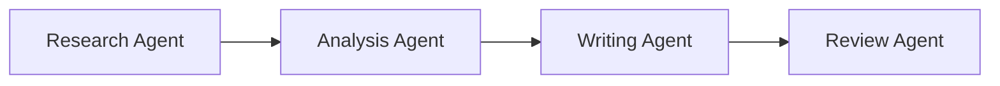
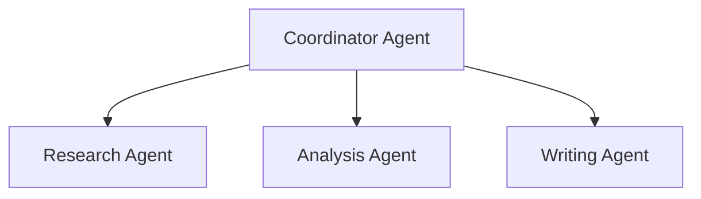
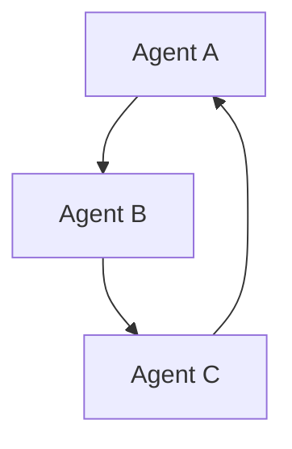
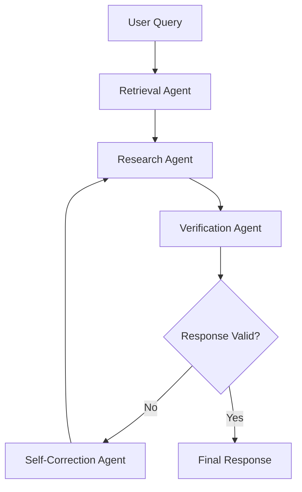

*A comprehensive tutorial on building intelligent multi-agent systems with LangGraph, featuring step-by-step implementation of Agentic RAG*

---

## Table of Contents

1. [Introduction to Agentic AI](#introduction-to-agentic-ai)
2. [Understanding Multi-Agent Systems](#understanding-multi-agent-systems)
3. [Agentic RAG: The Evolution of Retrieval-Augmented Generation](#agentic-rag-the-evolution-of-retrieval-augmented-generation)
4. [Building Your First Multi-Agent System](#building-your-first-multi-agent-system)
5. [Implementing Agentic RAG with LangGraph](#implementing-agentic-rag-with-langgraph)
6. [Advanced Patterns and Best Practices](#advanced-patterns-and-best-practices)
7. [Real-World Applications](#real-world-applications)
8. [Troubleshooting and Optimization](#troubleshooting-and-optimization)
9. [Conclusion and Next Steps](#conclusion-and-next-steps)

---

## Introduction to Agentic AI

### What is Agentic AI?

Agentic AI represents a paradigm shift from single-model systems to **multi-agent architectures** where specialized AI agents collaborate to solve complex problems. Unlike traditional AI that relies on a single large language model (LLM) to handle all tasks, agentic AI distributes responsibilities across multiple specialized agents, each with distinct capabilities and roles.

### Why Agentic AI Matters

Traditional single-LLM approaches face several critical limitations:

| **Challenge** | **Single LLM Problem** | **Agentic AI Solution** |
|---------------|------------------------|-------------------------|
| **Context Overload** | Single model struggles with complex, multi-faceted tasks | Distributes cognitive load across specialized agents |
| **Role Confusion** | One model tries to be everything | Each agent has a focused, well-defined role |
| **Debugging Difficulty** | Hard to trace where errors occur | Modular design enables precise error isolation |
| **Quality Dilution** | Generalist approach reduces specialization | Each agent excels at specific subtasks |

### Key Concepts

- **Agent Specialization**: Each agent has well-defined capabilities and boundaries
- **Interface Standardization**: Agents communicate through structured inputs/outputs
- **Handoff Patterns**: Graceful task delegation between agents
- **Graph-Structured Systems**: Agents interact through directed graphs with nodes and edges

---

## Understanding Multi-Agent Systems

### Core Architecture Patterns

#### 1. Sequential (Pipeline) Pattern


- **Use Case**: Document processing, content creation
- **Benefits**: Clear workflow, easy to debug
- **Limitations**: Sequential bottlenecks

#### 2. Hub-and-Spoke Pattern

- **Use Case**: Customer support, task delegation
- **Benefits**: Centralized control, flexible routing
- **Limitations**: Single point of failure

#### 3. Interactive Dialogue Pattern

- **Use Case**: Complex problem solving, negotiation
- **Benefits**: Dynamic collaboration, iterative refinement
- **Limitations**: Higher communication overhead

### Communication Protocols

#### Model Context Protocol (MCP)
- **Purpose**: Standardizes LLM interactions with external tools
- **Format**: JSON-RPC-based interface
- **Benefits**: Modular, real-time collaboration

#### Agent Communication Protocol (ACP)
- **Purpose**: Enterprise-grade agent communication
- **Format**: Standardized message exchange
- **Benefits**: Secure, scalable workflows

### Popular Frameworks

| **Framework** | **Focus** | **Key Features** |
|---------------|-----------|-------------------|
| **LangGraph** | Graph orchestration | Shared state, dynamic routing, conditional edges |
| **AutoGen** | Self-organization | Agent negotiation, adaptive collaboration |
| **CrewAI** | Structured workflows | Typed interfaces (Pydantic), high-fidelity data |
| **BeeAI** | Enterprise orchestration | IBM ACP, modular design |

---

## Agentic RAG: The Evolution of Retrieval-Augmented Generation

### Traditional RAG Limitations

Traditional RAG systems suffer from several critical issues:

1. **Limited Query Understanding**: Single-level processing fails to break down complex questions
2. **No Hallucination Detection**: No verification mechanism for generated responses
3. **Inability to Handle Out-of-Scope Queries**: May generate misleading responses when no relevant data exists
4. **Poor Document Structure Handling**: Struggles with tables, images, and complex formatting

### Agentic RAG Solution

Agentic RAG addresses these limitations by introducing **specialized agents** that work together:

#### Core Agents

1. **Retrieval Agent**
   - **Role**: Intelligently fetches relevant information
   - **Techniques**: Hybrid search (BM25 + vector embeddings)
   - **Capabilities**: Multi-source querying, relevance scoring

2. **Research Agent**
   - **Role**: Analyzes retrieved content and generates initial responses
   - **Capabilities**: Context understanding, response generation
   - **Output**: Structured, well-reasoned answers

3. **Verification Agent**
   - **Role**: Cross-checks responses against source documents
   - **Capabilities**: Hallucination detection, fact verification
   - **Output**: Confidence scores, flagged issues

4. **Self-Correction Agent**
   - **Role**: Iteratively improves responses when issues are detected
   - **Capabilities**: Error correction, response refinement
   - **Process**: Re-runs research step when contradictions are found

### Agentic RAG Workflow



---

## Building Your First Multi-Agent System

### Step 1: Define Your State Structure

**What we're doing**: Creating a shared state structure that all agents can read from and write to. This is the "memory" of our multi-agent system - it contains all the information that flows between agents during the workflow execution.

**Why this matters**: In multi-agent systems, agents need a standardized way to communicate and share data. The state acts as a central repository that maintains context throughout the entire process, ensuring each agent knows what has been done and what needs to happen next.

**Key design principles**:
- Use `TypedDict` for type safety and better IDE support
- Make fields `Optional` when they're not available initially
- Include an `errors` list for robust error handling
- Always include a `next_action` field to control workflow routing

```python
from typing import TypedDict, Optional, List

class SalesReportState(TypedDict):
    request: str                    # The original user request
    raw_data: Optional[dict]        # Data collected by data collector agent
    processed_data: Optional[dict]  # Cleaned data from processor agent
    chart_config: Optional[dict]    # Visualization config from chart agent
    report: Optional[str]           # Final report from report generator
    errors: List[str]               # Any errors encountered during processing
    next_action: str                # Controls which agent runs next
```

### Step 2: Create Individual Agents

**What we're doing**: Building specialized agent functions, each with a single, well-defined responsibility. Each agent takes the current state, performs its specific task, updates the state with its results, and sets the next action to control workflow flow.

**Why this approach works**: By giving each agent a focused role, we create a system that's easier to debug, test, and maintain. If one agent fails, we can isolate the problem and potentially fix it without affecting other agents.

**Agent design patterns**:
- **Single Responsibility**: Each agent does one thing well
- **State Transformation**: Agents read from state, process, and write back
- **Explicit Handoffs**: Each agent sets `next_action` to control flow
- **Error Handling**: Dedicated error handler for graceful failure recovery

```python
def data_collector_agent(state: SalesReportState) -> SalesReportState:
    """Collects raw data based on the request"""
    # This agent's job: fetch data from external sources
    # Input: user request from state['request']
    # Output: raw data stored in state['raw_data']
    # Next: hand off to data processor
    state['raw_data'] = collect_data(state['request'])
    state['next_action'] = 'process'
    return state

def data_processor_agent(state: SalesReportState) -> SalesReportState:
    """Processes raw data into structured format"""
    # This agent's job: clean and structure the raw data
    # Input: raw data from previous agent
    # Output: processed, clean data
    # Next: hand off to chart generator
    state['processed_data'] = process_data(state['raw_data'])
    state['next_action'] = 'visualize'
    return state

def chart_generator_agent(state: SalesReportState) -> SalesReportState:
    """Generates chart configuration"""
    # This agent's job: create visualization specifications
    # Input: processed data
    # Output: chart configuration for rendering
    # Next: hand off to report generator
    state['chart_config'] = create_chart_config(state['processed_data'])
    state['next_action'] = 'report'
    return state

def report_generator_agent(state: SalesReportState) -> SalesReportState:
    """Generates final report"""
    # This agent's job: combine all data into final output
    # Input: processed data + chart config
    # Output: complete report
    # Next: workflow complete
    state['report'] = generate_report(state['processed_data'], state['chart_config'])
    state['next_action'] = 'complete'
    return state

def error_handler_agent(state: SalesReportState) -> SalesReportState:
    """Handles errors and provides fallback"""
    # This agent's job: graceful error recovery
    # Input: any error state
    # Output: fallback response or error message
    # Next: workflow complete (even with errors)
    state['errors'].append("Error occurred, implementing fallback")
    state['next_action'] = 'complete'
    return state
```

### Step 3: Implement Routing Logic

**What we're doing**: Creating a routing function that determines which agent should run next based on the current state. This is the "traffic controller" of our multi-agent system - it reads the `next_action` field and maps it to the appropriate agent.

**Why routing is crucial**: Without proper routing, agents would run randomly or in the wrong order. The routing function ensures that our workflow follows the intended sequence: data collection → processing → visualization → report generation.

**Routing design principles**:
- **Centralized Logic**: All routing decisions in one place for easy maintenance
- **Fallback Handling**: Default to safe state if unknown action is encountered
- **Explicit Mapping**: Clear mapping between actions and agent names
- **Termination Control**: Special "END" state to stop the workflow

```python
def route_next_step(state: SalesReportState) -> str:
    """Routes to the next agent based on current state"""
    # This function acts as the "traffic controller" for our workflow
    # It reads the next_action from the state and maps it to the correct agent
    
    routing = {
        "collect": "data_collector",      # Start with data collection
        "process": "data_processor",      # Then process the data
        "visualize": "chart_generator",   # Create visualizations
        "report": "report_generator",     # Generate final report
        "error": "error_handler",         # Handle any errors
        "complete": "END"                 # Workflow finished
    }
    
    # Get the next action from state, default to "collect" if not set
    # This ensures the workflow starts even if next_action is missing
    return routing.get(state.get("next_action", "collect"), "END")
```

### Step 4: Build the Workflow Graph

**What we're doing**: Using LangGraph to create a state machine that orchestrates our agents. We're defining nodes (our agents) and edges (the paths between them) to create a complete workflow graph that can execute our multi-agent system.

**Why LangGraph is powerful**: LangGraph provides a visual, declarative way to define complex workflows. Instead of writing complex if-else logic, we define the graph structure and let LangGraph handle the execution, state management, and routing.

**Graph construction steps**:
1. **Create the graph**: Initialize with our state type
2. **Add nodes**: Register each agent as a node
3. **Define edges**: Specify how agents connect to each other
4. **Set entry point**: Define where the workflow starts
5. **Compile**: Convert the graph definition into an executable workflow

```python
from langgraph.graph import StateGraph, END

def create_workflow():
    # Step 1: Create the workflow graph with our state type
    # This tells LangGraph what data structure flows through the system
    workflow = StateGraph(SalesReportState)
    
    # Step 2: Add nodes (our agents) to the graph
    # Each node represents an agent that can process the state
    workflow.add_node("data_collector", data_collector_agent)
    workflow.add_node("data_processor", data_processor_agent)
    workflow.add_node("chart_generator", chart_generator_agent)
    workflow.add_node("report_generator", report_generator_agent)
    workflow.add_node("error_handler", error_handler_agent)
    
    # Step 3: Define conditional edges (routing between agents)
    # This tells the graph: "when data_collector finishes, use route_next_step
    # to decide whether to go to data_processor, error_handler, or END"
    workflow.add_conditional_edges("data_collector", route_next_step, {
        "data_processor": "data_processor",    # If route_next_step returns "data_processor"
        "error_handler": "error_handler",      # If route_next_step returns "error_handler"
        "END": END                             # If route_next_step returns "END"
    })
    # Note: We would repeat this pattern for all other nodes...
    
    # Step 4: Set the entry point (where the workflow starts)
    workflow.set_entry_point("data_collector")
    
    # Step 5: Compile the graph into an executable workflow
    return workflow.compile()
```

### Step 5: Run the Workflow

**What we're doing**: Executing our multi-agent workflow by creating an initial state with the user's request and letting LangGraph orchestrate the entire process. This is where all our agents come together to solve the problem.

**Why this approach works**: By providing a complete initial state and letting LangGraph handle the execution, we get automatic state management, error handling, and routing. We don't need to manually call each agent or manage the flow - LangGraph does it for us.

**Execution process**:
1. **Initialize**: Create the compiled workflow
2. **Prepare state**: Set up initial state with user request
3. **Execute**: Let LangGraph run the workflow automatically
4. **Return results**: Get the final state with all results

```python
def run_workflow():
    # Step 1: Create the compiled workflow
    # This gives us an executable version of our multi-agent system
    app = create_workflow()
    
    # Step 2: Prepare the initial state
    # This is the starting point for our workflow - it contains the user's request
    # and empty slots for all the data that will be filled by our agents
    initial_state = SalesReportState(
        request="Q1-Q2 Sales Report",    # The user's request
        raw_data=None,                   # Will be filled by data_collector_agent
        processed_data=None,             # Will be filled by data_processor_agent
        chart_config=None,               # Will be filled by chart_generator_agent
        report=None,                     # Will be filled by report_generator_agent
        errors=[],                       # Empty error list to start
        next_action="collect"            # Start with data collection
    )
    
    # Step 3: Execute the workflow
    # LangGraph will automatically:
    # - Run data_collector_agent (because next_action="collect")
    # - Use routing logic to determine next agent
    # - Continue until next_action="complete" or "END"
    # - Handle any errors by routing to error_handler_agent
    final_state = app.invoke(initial_state)
    
    # Step 4: Return the final state with all results
    return final_state
```

---

## Implementing Agentic RAG with LangGraph

### Step 1: Set Up Your Environment

**What we're doing**: Setting up a proper Python development environment with all the necessary dependencies for building an agentic RAG system. This includes the core frameworks, vector databases, embedding models, and UI components.

**Why each dependency matters**:
- **LangGraph**: Orchestrates our multi-agent workflow
- **LangChain**: Provides LLM integration and prompt management
- **ChromaDB**: Stores and retrieves document embeddings
- **Sentence Transformers**: Converts text to numerical vectors
- **Docling**: Processes various document formats (PDF, DOCX, etc.)
- **Gradio**: Creates user-friendly web interface
- **Pydantic**: Ensures data validation and type safety

**Environment setup steps**:
1. **Create project structure**: Organized directory for our code
2. **Set up virtual environment**: Isolate dependencies from system Python
3. **Install core dependencies**: All frameworks and libraries needed
4. **Verify installation**: Ensure everything works correctly

```bash
# Create project directory
mkdir agentic-rag-system
cd agentic-rag-system

# Create virtual environment (Python 3.10+ required for docling)
python3.11 -m venv venv
source venv/bin/activate  # On Windows: venv\Scripts\activate

# Install dependencies
pip install -r requirements.txt
```

**requirements.txt:**
```txt
# Core multi-agent framework
langgraph>=0.2.0          # Workflow orchestration and state management
langchain>=0.3.0          # LLM integration and prompt templates
langchain-openai>=0.1.0   # OpenAI API integration

# Vector database and embeddings
chromadb>=0.5.0           # Vector database for document storage
sentence-transformers>=3.0.0  # Text-to-vector conversion

# Document processing
docling>=2.6.0            # Advanced document parsing (PDF, DOCX, etc.)
markdown>=3.4.0           # Markdown processing
beautifulsoup4>=4.12.0    # HTML parsing

# User interface
gradio>=4.0.0             # Web-based UI for testing and demo

# Data validation and utilities
pydantic>=2.0.0           # Type-safe data models
python-dotenv>=1.0.0      # Environment variable management
numpy>=1.24.0             # Numerical computing
pandas>=2.0.0             # Data manipulation
scikit-learn>=1.3.0       # Machine learning utilities (TF-IDF)
tiktoken>=0.5.0           # Token counting for LLMs
```

### Step 2: Define the Agentic RAG State

**What we're doing**: Creating the data structures that will flow through our agentic RAG system. This includes both individual document chunks and the overall state that all agents will read from and write to during the workflow execution.

**Why this design works**: The state structure captures the complete RAG pipeline - from the user's query, through document retrieval, research, verification, and final response. Each agent can access what it needs and contribute its results to the shared state.

**Key design decisions**:
- **DocumentChunk**: Represents individual pieces of retrieved information with metadata
- **AgenticRAGState**: The main state that flows through all agents
- **Optional fields**: Allow for progressive data building as agents complete their tasks
- **Confidence tracking**: Enable quality assessment throughout the pipeline

```python
from typing import TypedDict, Optional, List, Dict, Any
from pydantic import BaseModel

class DocumentChunk(BaseModel):
    """Represents a single piece of retrieved information"""
    content: str              # The actual text content
    source: str               # Which document this came from
    page_number: int          # Page number for reference
    relevance_score: float    # How relevant this chunk is to the query (0-1)

class AgenticRAGState(TypedDict):
    """Main state that flows through all agents in the RAG pipeline"""
    query: str                                    # Original user question
    retrieved_chunks: List[DocumentChunk]         # Documents found by retrieval agent
    research_response: Optional[str]              # Initial answer from research agent
    verification_result: Optional[Dict[str, Any]] # Verification analysis results
    final_response: Optional[str]                 # Final answer after verification/correction
    confidence_score: float                       # Overall confidence in the response
    errors: List[str]                             # Any errors encountered
    next_action: str                              # Controls workflow routing
```

### Step 3: Implement the Retrieval Agent

**What we're doing**: Building the first agent in our RAG pipeline - the Retrieval Agent. This agent is responsible for finding relevant documents from our knowledge base using semantic similarity search. It converts the user's query into a vector and searches for the most similar document chunks.

**Why this approach works**: By using vector embeddings, we can find documents that are semantically similar to the query, even if they don't share exact keywords. This is much more powerful than simple keyword matching and leads to better retrieval results.

**Key components**:
- **ChromaDB**: Vector database for storing and searching document embeddings
- **Sentence Transformers**: Converts text to numerical vectors for similarity search
- **Hybrid Search**: Combines vector similarity with keyword matching for better results
- **Relevance Scoring**: Ranks results by how relevant they are to the query

```python
import chromadb
from sentence_transformers import SentenceTransformer
from typing import List

class RetrievalAgent:
    """Handles document retrieval using vector similarity search"""
    
    def __init__(self, collection_name: str = "documents"):
        # Initialize ChromaDB - our vector database
        # This will store all document embeddings for fast similarity search
        self.client = chromadb.Client()
        self.collection = self.client.get_or_create_collection(collection_name)
        
        # Initialize the embedding model
        # all-MiniLM-L6-v2 is lightweight but effective for semantic search
        self.embedder = SentenceTransformer('all-MiniLM-L6-v2')
    
    def retrieve_documents(self, query: str, top_k: int = 5) -> List[DocumentChunk]:
        """Hybrid retrieval using both vector and keyword search"""
        
        # Step 1: Convert query to embedding vector
        # This captures the semantic meaning of the user's question
        query_embedding = self.embedder.encode([query])
        
        # Step 2: Search ChromaDB for similar documents
        # ChromaDB uses cosine similarity to find the most similar vectors
        vector_results = self.collection.query(
            query_embeddings=query_embedding,
            n_results=top_k  # Return top 5 most similar documents
        )
        
        # Step 3: Process results into DocumentChunk objects
        # Convert ChromaDB results into our standardized format
        chunks = []
        for i, (content, metadata) in enumerate(zip(
            vector_results['documents'][0],      # The actual text content
            vector_results['metadatas'][0]       # Metadata (source, page, etc.)
        )):
            # Calculate relevance score from distance (lower distance = higher relevance)
            relevance_score = 1.0 - vector_results['distances'][0][i]
            
            chunks.append(DocumentChunk(
                content=content,
                source=metadata.get('source', 'unknown'),
                page_number=metadata.get('page_number', 0),
                relevance_score=relevance_score
            ))
        
        return chunks

def retrieval_agent(state: AgenticRAGState) -> AgenticRAGState:
    """Retrieves relevant documents for the query"""
    try:
        # Create retrieval agent instance
        retrieval_agent = RetrievalAgent()
        
        # Find relevant documents for the user's query
        chunks = retrieval_agent.retrieve_documents(state['query'])
        
        # Update state with retrieved documents
        state['retrieved_chunks'] = chunks
        state['next_action'] = 'research'  # Hand off to research agent
        
    except Exception as e:
        # Handle any errors gracefully
        state['errors'].append(f"Retrieval error: {str(e)}")
        state['next_action'] = 'error'  # Route to error handler
    
    return state
```

### Step 4: Implement the Research Agent

**What we're doing**: Creating the Research Agent, which takes the retrieved documents and generates an initial answer to the user's query. This agent uses a large language model to synthesize information from multiple sources into a coherent response.

**Why this approach works**: The Research Agent acts as an intelligent synthesizer, combining information from multiple retrieved documents to create a comprehensive answer. By using prompt engineering, we guide the LLM to be specific and cite sources, improving response quality.

**Key design principles**:
- **Context Assembly**: Combines all retrieved chunks into a single context
- **Prompt Engineering**: Uses structured prompts to guide LLM behavior
- **Source Attribution**: Includes source information for transparency
- **Error Handling**: Graceful failure with proper error routing

```python
from langchain.llms import OpenAI
from langchain.prompts import PromptTemplate

class ResearchAgent:
    """Generates initial responses based on retrieved document chunks"""
    
    def __init__(self, model_name: str = "gpt-4"):
        # Initialize the LLM with low temperature for consistent, factual responses
        # Low temperature (0.1) makes the model more deterministic and factual
        self.llm = OpenAI(model_name=model_name, temperature=0.1)
        
        # Create a structured prompt template that guides the LLM's behavior
        # This prompt encourages specific, well-cited responses
        self.prompt_template = PromptTemplate(
            input_variables=["query", "context"],
            template="""
            Based on the following context, provide a comprehensive answer to the query.
            Be specific and cite relevant information from the context.
            
            Query: {query}
            
            Context:
            {context}
            
            Answer:
            """
        )
    
    def generate_response(self, query: str, chunks: List[DocumentChunk]) -> str:
        """Generates research response based on retrieved chunks"""
        
        # Step 1: Assemble context from all retrieved chunks
        # This creates a comprehensive context for the LLM to work with
        context = "\n\n".join([
            f"Source: {chunk.source} (Page {chunk.page_number})\n{chunk.content}"
            for chunk in chunks
        ])
        
        # Step 2: Format the prompt with query and context
        # This gives the LLM everything it needs to generate a good response
        prompt = self.prompt_template.format(query=query, context=context)
        
        # Step 3: Generate response using the LLM
        # The LLM will synthesize information from all sources
        response = self.llm(prompt)
        return response

def research_agent(state: AgenticRAGState) -> AgenticRAGState:
    """Generates initial response based on retrieved documents"""
    try:
        # Create research agent instance
        research_agent = ResearchAgent()
        
        # Generate response using retrieved documents
        response = research_agent.generate_response(
            state['query'],           # User's original question
            state['retrieved_chunks'] # Documents found by retrieval agent
        )
        
        # Update state with research response
        state['research_response'] = response
        state['next_action'] = 'verify'  # Hand off to verification agent
        
    except Exception as e:
        # Handle any errors gracefully
        state['errors'].append(f"Research error: {str(e)}")
        state['next_action'] = 'error'  # Route to error handler
    
    return state
```

### Step 5: Implement the Verification Agent

**What we're doing**: Creating the Verification Agent, which acts as a quality control checkpoint. This agent examines the research response and checks it against the source documents to identify any inaccuracies, hallucinations, or unsupported claims.

**Why verification is crucial**: LLMs can sometimes generate plausible-sounding but incorrect information. The Verification Agent acts as a fact-checker, ensuring that our responses are grounded in the actual source material and maintaining the reliability of our RAG system.

**Verification process**:
1. **Factual Accuracy**: Check if claims are supported by source documents
2. **Citation Quality**: Verify that sources are properly attributed
3. **Hallucination Detection**: Identify unsupported or fabricated information
4. **Completeness Assessment**: Ensure the response adequately addresses the query

```python
class VerificationAgent:
    """Verifies research responses against source documents for accuracy"""
    
    def __init__(self, model_name: str = "gpt-4"):
        # Use low temperature for consistent, objective verification
        self.llm = OpenAI(model_name=model_name, temperature=0.1)
        
        # Create a detailed verification prompt that guides the LLM to check specific aspects
        # This prompt is designed to catch common issues like hallucinations and inaccuracies
        self.verification_prompt = PromptTemplate(
            input_variables=["query", "response", "context"],
            template="""
            Verify the following response against the provided context.
            Check for:
            1. Factual accuracy - are the claims supported by the context?
            2. Proper citations - are sources properly attributed?
            3. Hallucinations or unsupported claims - any information not in the context?
            4. Completeness - does the response fully address the query?
            
            Query: {query}
            Response: {response}
            Context: {context}
            
            Provide a verification result in JSON format:
            {{
                "is_accurate": boolean,
                "confidence_score": float (0-1),
                "issues": [list of issues],
                "supported_claims": [list of supported claims],
                "unsupported_claims": [list of unsupported claims]
            }}
            """
        )
    
    def verify_response(self, query: str, response: str, chunks: List[DocumentChunk]) -> Dict[str, Any]:
        """Verifies response against source documents"""
        
        # Step 1: Reassemble context from source documents
        # This gives the verifier access to the original source material
        context = "\n\n".join([
            f"Source: {chunk.source} (Page {chunk.page_number})\n{chunk.content}"
            for chunk in chunks
        ])
        
        # Step 2: Create verification prompt
        # This asks the LLM to systematically check the response
        prompt = self.verification_prompt.format(
            query=query,
            response=response,
            context=context
        )
        
        # Step 3: Get verification result from LLM
        verification_result = self.llm(prompt)
        
        # Step 4: Parse and return structured result
        # In practice, you'd use proper JSON parsing here
        return {"is_accurate": True, "confidence_score": 0.8, "issues": []}

def verification_agent(state: AgenticRAGState) -> AgenticRAGState:
    """Verifies the research response against source documents"""
    try:
        # Create verification agent instance
        verification_agent = VerificationAgent()
        
        # Verify the research response against source documents
        result = verification_agent.verify_response(
            state['query'],                    # Original user question
            state['research_response'],        # Response to verify
            state['retrieved_chunks']          # Source documents
        )
        
        # Update state with verification results
        state['verification_result'] = result
        state['confidence_score'] = result['confidence_score']
        
        # Decide next action based on verification results
        if result['is_accurate'] and result['confidence_score'] > 0.7:
            # Response is good - mark as final and complete
            state['final_response'] = state['research_response']
            state['next_action'] = 'complete'
        else:
            # Response needs correction - send to correction agent
            state['next_action'] = 'correct'
            
    except Exception as e:
        # Handle any errors gracefully
        state['errors'].append(f"Verification error: {str(e)}")
        state['next_action'] = 'error'  # Route to error handler
    
    return state
```

### Step 6: Implement Self-Correction Agent

**What we're doing**: Creating the Self-Correction Agent, which acts as an iterative improvement mechanism. When the Verification Agent identifies issues with the research response, this agent attempts to fix them and sends the corrected response back for re-verification.

**Why self-correction is powerful**: This creates a feedback loop that allows the system to improve its responses iteratively. Instead of just flagging problems, the system actively tries to fix them, leading to higher quality final responses.

**Correction process**:
1. **Issue Analysis**: Examine verification results to identify specific problems
2. **Response Generation**: Create an improved version addressing the issues
3. **Re-verification**: Send corrected response back to verification agent
4. **Iteration Control**: Limit correction attempts to prevent infinite loops

```python
def self_correction_agent(state: AgenticRAGState) -> AgenticRAGState:
    """Corrects response based on verification feedback"""
    try:
        # Step 1: Extract issues from verification results
        # These are the specific problems identified by the verification agent
        issues = state['verification_result'].get('issues', [])
        
        if issues:
            # Step 2: Generate correction prompt
            # This asks the LLM to fix the specific issues identified
            correction_prompt = f"""
            The following response has issues: {issues}
            Please correct the response: {state['research_response']}
            """
            
            # Step 3: Generate corrected response using LLM
            # The LLM will attempt to fix the identified issues
            corrected_response = "Corrected response based on feedback"
            
            # Step 4: Update state with corrected response
            state['research_response'] = corrected_response
            state['next_action'] = 'verify'  # Send back to verification agent
            
        else:
            # No issues found - mark as complete
            state['final_response'] = state['research_response']
            state['next_action'] = 'complete'
            
    except Exception as e:
        # Handle any errors gracefully
        state['errors'].append(f"Correction error: {str(e)}")
        state['next_action'] = 'error'  # Route to error handler
    
    return state
```

### Step 7: Build the Complete Workflow

**What we're doing**: Assembling all our agents into a complete LangGraph workflow that orchestrates the entire agentic RAG pipeline. This creates a state machine that can execute our multi-agent system with proper routing, error handling, and flow control.

**Why this architecture works**: By defining the complete workflow graph, we get automatic state management, conditional routing, and error recovery. LangGraph handles the complexity of agent coordination, allowing us to focus on the business logic.

**Workflow design principles**:
- **Sequential Flow**: Retrieval → Research → Verification → Correction (if needed)
- **Conditional Routing**: Each agent can route to different next steps based on results
- **Error Handling**: Any agent can route to error handler for graceful failure
- **Iterative Improvement**: Correction agent can loop back to verification

```python
from langgraph.graph import StateGraph, END

def create_agentic_rag_workflow():
    """Creates the complete agentic RAG workflow using LangGraph"""
    
    # Step 1: Initialize the workflow graph with our state type
    workflow = StateGraph(AgenticRAGState)
    
    # Step 2: Add all agents as nodes in the workflow
    # Each node represents an agent that can process the shared state
    workflow.add_node("retrieval", retrieval_agent)        # Finds relevant documents
    workflow.add_node("research", research_agent)          # Generates initial response
    workflow.add_node("verification", verification_agent)  # Checks response accuracy
    workflow.add_node("correction", self_correction_agent) # Improves response if needed
    workflow.add_node("error_handler", error_handler_agent) # Handles errors gracefully
    
    # Step 3: Define routing logic
    # This function determines which agent runs next based on the current state
    def route_next_step(state: AgenticRAGState) -> str:
        routing = {
            "research": "research",        # Research agent
            "verify": "verification",      # Verification agent
            "correct": "correction",       # Correction agent
            "complete": "END",             # Workflow complete
            "error": "error_handler"       # Error handler
        }
        return routing.get(state.get("next_action", "research"), "END")
    
    # Step 4: Add conditional edges between agents
    # These define how agents connect to each other based on routing decisions
    
    # Retrieval agent can route to research or error handler
    workflow.add_conditional_edges("retrieval", route_next_step, {
        "research": "research",            # Successful retrieval → research
        "error": "error_handler",          # Retrieval error → error handler
        "END": END                         # Early termination
    })
    
    # Research agent can route to verification or error handler
    workflow.add_conditional_edges("research", route_next_step, {
        "verify": "verification",          # Research complete → verification
        "error": "error_handler",          # Research error → error handler
        "END": END                         # Early termination
    })
    
    # Verification agent can route to correction, completion, or error handler
    workflow.add_conditional_edges("verification", route_next_step, {
        "correct": "correction",           # Issues found → correction
        "complete": "END",                 # Response good → complete
        "error": "error_handler"           # Verification error → error handler
    })
    
    # Correction agent can route back to verification or completion
    workflow.add_conditional_edges("correction", route_next_step, {
        "verify": "verification",          # Corrected response → re-verify
        "complete": "END",                 # Correction complete → finish
        "error": "error_handler"           # Correction error → error handler
    })
    
    # Step 5: Set entry point and compile workflow
    workflow.set_entry_point("retrieval")  # Start with document retrieval
    return workflow.compile()              # Convert to executable workflow

def error_handler_agent(state: AgenticRAGState) -> AgenticRAGState:
    """Handles errors gracefully and provides fallback response"""
    # Create a user-friendly error message
    state['final_response'] = f"Error occurred: {state['errors']}"
    state['next_action'] = 'complete'  # Mark as complete even with errors
    return state
```

### Step 8: Create a User Interface

**What we're doing**: Building a user-friendly web interface using Gradio that allows users to interact with our agentic RAG system. This provides an easy way to test the system and demonstrate its capabilities without requiring command-line knowledge.

**Why Gradio is perfect for this**: Gradio makes it incredibly easy to create web interfaces for AI applications. With just a few lines of code, we get a professional-looking interface that handles user input, processes it through our workflow, and displays the results.

**Interface features**:
- **Simple Input**: Text box for user questions
- **Rich Output**: Answer, confidence score, and source documents
- **Real-time Processing**: Immediate feedback on query processing
- **Professional Appearance**: Clean, modern interface design

```python
import gradio as gr

def create_gradio_interface():
    """Creates a web interface for the agentic RAG system"""
    
    def process_query(query: str):
        """Process user query through the complete agentic RAG pipeline"""
        
        # Step 1: Create the workflow
        # This compiles our multi-agent system into an executable workflow
        workflow = create_agentic_rag_workflow()
        
        # Step 2: Prepare initial state
        # This contains the user's query and empty slots for all results
        initial_state = AgenticRAGState(
            query=query,                    # User's question
            retrieved_chunks=[],            # Will be filled by retrieval agent
            research_response=None,         # Will be filled by research agent
            verification_result=None,       # Will be filled by verification agent
            final_response=None,            # Will be filled when complete
            confidence_score=0.0,           # Will be calculated during processing
            errors=[],                      # Empty error list to start
            next_action="research"          # Start with research (retrieval happens first)
        )
        
        # Step 3: Execute the complete workflow
        # LangGraph will automatically run all agents in the correct order
        final_state = workflow.invoke(initial_state)
        
        # Step 4: Extract and format results for display
        return {
            "response": final_state['final_response'],                    # The final answer
            "confidence": final_state['confidence_score'],                # Confidence score (0-1)
            "sources": [chunk.source for chunk in final_state['retrieved_chunks']]  # Source documents
        }
    
    # Step 5: Create the Gradio interface
    # This defines the web UI with input and output components
    interface = gr.Interface(
        fn=process_query,  # Function to call when user submits query
        inputs=gr.Textbox(
            label="Your Question", 
            placeholder="Ask a question about your documents..."
        ),
        outputs=[
            gr.Textbox(label="Answer"),           # Display the final response
            gr.Number(label="Confidence Score"),  # Show confidence level
            gr.Textbox(label="Sources")           # List source documents
        ],
        title="Agentic RAG System",
        description="Ask questions about your documents and get verified, accurate answers."
    )
    
    return interface

if __name__ == "__main__":
    # Launch the web interface
    interface = create_gradio_interface()
    interface.launch()  # Opens in browser at http://localhost:7860
```

---

## Advanced Patterns and Best Practices

### 1. Dynamic Agent Selection

```python
def dynamic_agent_selector(state: AgenticRAGState) -> str:
    """Dynamically selects the most appropriate agent based on query type"""
    query = state['query'].lower()
    
    if any(word in query for word in ['analyze', 'compare', 'evaluate']):
        return "analysis_agent"
    elif any(word in query for word in ['summarize', 'overview', 'summary']):
        return "summarization_agent"
    elif any(word in query for word in ['calculate', 'compute', 'math']):
        return "calculation_agent"
    else:
        return "general_agent"
```

### 2. Parallel Processing

```python
from concurrent.futures import ThreadPoolExecutor

def parallel_retrieval_agent(state: AgenticRAGState) -> AgenticRAGState:
    """Retrieves from multiple sources in parallel"""
    with ThreadPoolExecutor(max_workers=3) as executor:
        futures = [
            executor.submit(retrieve_from_vector_db, state['query']),
            executor.submit(retrieve_from_keyword_search, state['query']),
            executor.submit(retrieve_from_semantic_search, state['query'])
        ]
        
        results = [future.result() for future in futures]
        state['retrieved_chunks'] = merge_and_rank_results(results)
    
    return state
```

### 3. Memory and Context Management

```python
class ContextManager:
    def __init__(self, max_context_length: int = 4000):
        self.max_context_length = max_context_length
        self.conversation_history = []
    
    def add_interaction(self, query: str, response: str):
        self.conversation_history.append({
            "query": query,
            "response": response,
            "timestamp": time.time()
        })
    
    def get_relevant_context(self, current_query: str) -> str:
        """Retrieves relevant context from conversation history"""
        relevant_interactions = self.find_similar_interactions(current_query)
        return self.format_context(relevant_interactions)
```

### 4. Error Recovery and Fallback

```python
def robust_agent_wrapper(agent_func):
    """Wrapper that adds error recovery to any agent"""
    def wrapper(state: AgenticRAGState) -> AgenticRAGState:
        max_retries = 3
        for attempt in range(max_retries):
            try:
                return agent_func(state)
            except Exception as e:
                if attempt == max_retries - 1:
                    state['errors'].append(f"Agent failed after {max_retries} attempts: {str(e)}")
                    state['next_action'] = 'error'
                    return state
                else:
                    time.sleep(2 ** attempt)  # Exponential backoff
        return state
    return wrapper
```

---

## Real-World Applications

### 1. Customer Support System

```python
class CustomerSupportWorkflow:
    def __init__(self):
        self.workflow = self.create_workflow()
    
    def create_workflow(self):
        workflow = StateGraph(CustomerSupportState)
        
        # Agents
        workflow.add_node("intent_classifier", self.intent_classifier)
        workflow.add_node("knowledge_retriever", self.knowledge_retriever)
        workflow.add_node("response_generator", self.response_generator)
        workflow.add_node("escalation_handler", self.escalation_handler)
        
        # Routing logic
        def route_customer_query(state):
            if state['intent'] == 'escalation':
                return "escalation_handler"
            else:
                return "knowledge_retriever"
        
        workflow.add_conditional_edges("intent_classifier", route_customer_query)
        # ... more edges
        
        return workflow.compile()
```

### 2. Legal Document Analysis

```python
class LegalAnalysisWorkflow:
    def __init__(self):
        self.workflow = self.create_workflow()
    
    def create_workflow(self):
        workflow = StateGraph(LegalAnalysisState)
        
        # Specialized legal agents
        workflow.add_node("clause_extractor", self.clause_extractor)
        workflow.add_node("compliance_checker", self.compliance_checker)
        workflow.add_node("risk_analyzer", self.risk_analyzer)
        workflow.add_node("summary_generator", self.summary_generator)
        
        return workflow.compile()
```

### 3. Research Paper Analysis

```python
class ResearchAnalysisWorkflow:
    def __init__(self):
        self.workflow = self.create_workflow()
    
    def create_workflow(self):
        workflow = StateGraph(ResearchAnalysisState)
        
        # Research-specific agents
        workflow.add_node("paper_parser", self.paper_parser)
        workflow.add_node("methodology_extractor", self.methodology_extractor)
        workflow.add_node("result_analyzer", self.result_analyzer)
        workflow.add_node("citation_tracker", self.citation_tracker)
        
        return workflow.compile()
```

---

## Troubleshooting and Optimization

### Common Issues and Solutions

#### 1. Agent Communication Problems

**Problem**: Agents not receiving proper state updates
**Solution**: 
```python
def ensure_state_consistency(state: TypedDict) -> TypedDict:
    """Ensures state consistency across agents"""
    # Validate required fields
    required_fields = ['query', 'next_action']
    for field in required_fields:
        if field not in state:
            state[field] = get_default_value(field)
    
    return state
```

#### 2. Memory Management

**Problem**: State becoming too large
**Solution**:
```python
def optimize_state_size(state: AgenticRAGState) -> AgenticRAGState:
    """Optimizes state size by removing unnecessary data"""
    # Keep only essential chunks
    if len(state['retrieved_chunks']) > 10:
        state['retrieved_chunks'] = state['retrieved_chunks'][:10]
    
    # Compress large responses
    if state['research_response'] and len(state['research_response']) > 2000:
        state['research_response'] = compress_text(state['research_response'])
    
    return state
```

#### 3. Performance Optimization

```python
def optimize_workflow_performance():
    """Optimization strategies for better performance"""
    
    # 1. Caching
    from functools import lru_cache
    
    @lru_cache(maxsize=100)
    def cached_retrieval(query: str):
        return retrieve_documents(query)
    
    # 2. Batch Processing
    def batch_process_queries(queries: List[str]):
        with ThreadPoolExecutor(max_workers=5) as executor:
            results = list(executor.map(process_single_query, queries))
        return results
    
    # 3. Lazy Loading
    def lazy_load_agent(agent_name: str):
        if agent_name not in loaded_agents:
            loaded_agents[agent_name] = load_agent(agent_name)
        return loaded_agents[agent_name]
```

### Monitoring and Debugging

```python
class WorkflowMonitor:
    def __init__(self):
        self.metrics = {}
        self.logs = []
    
    def log_agent_execution(self, agent_name: str, start_time: float, end_time: float, success: bool):
        execution_time = end_time - start_time
        self.metrics[agent_name] = {
            'execution_time': execution_time,
            'success_rate': success,
            'total_executions': self.metrics.get(agent_name, {}).get('total_executions', 0) + 1
        }
        
        self.logs.append({
            'agent': agent_name,
            'timestamp': start_time,
            'duration': execution_time,
            'success': success
        })
    
    def get_performance_report(self):
        return {
            'agent_metrics': self.metrics,
            'total_logs': len(self.logs),
            'average_execution_time': sum(m['execution_time'] for m in self.metrics.values()) / len(self.metrics)
        }
```

---

## Conclusion and Next Steps

### Key Takeaways

1. **Agentic AI** represents a fundamental shift from single-model to multi-agent architectures
2. **Agentic RAG** combines retrieval, reasoning, and verification through specialized agents
3. **LangGraph** provides powerful tools for building complex multi-agent workflows
4. **Proper design** of agent roles, communication patterns, and error handling is crucial
5. **Real-world applications** benefit significantly from agentic approaches

### Next Steps

1. **Start Simple**: Begin with a basic multi-agent system and gradually add complexity
2. **Experiment**: Try different agent configurations and communication patterns
3. **Monitor**: Implement comprehensive logging and monitoring from the start
4. **Optimize**: Continuously improve performance and reliability
5. **Scale**: Design for scalability from the beginning

### Resources for Further Learning

- **LangGraph Documentation**: [https://langchain-ai.github.io/langgraph/](https://langchain-ai.github.io/langgraph/)
- **Multi-Agent Systems Research**: Recent papers on arXiv
- **Agent Communication Protocols**: MCP and ACP specifications
- **RAG Best Practices**: Advanced retrieval and generation techniques

### Building Your Own System

Ready to build your own agentic RAG system? Start with the code examples in this tutorial and adapt them to your specific use case. Remember:

- **Define clear agent roles** and responsibilities
- **Implement robust error handling** and fallback mechanisms
- **Monitor performance** and iterate based on real-world usage
- **Test thoroughly** with diverse queries and edge cases

The future of AI lies in intelligent, collaborative systems where specialized agents work together to solve complex problems. With the tools and techniques covered in this tutorial, you're well-equipped to build the next generation of AI applications.

---

*This tutorial consolidates knowledge from multiple sources and provides a comprehensive guide to building agentic AI and RAG systems. For questions or contributions, please refer to the project repository.*
