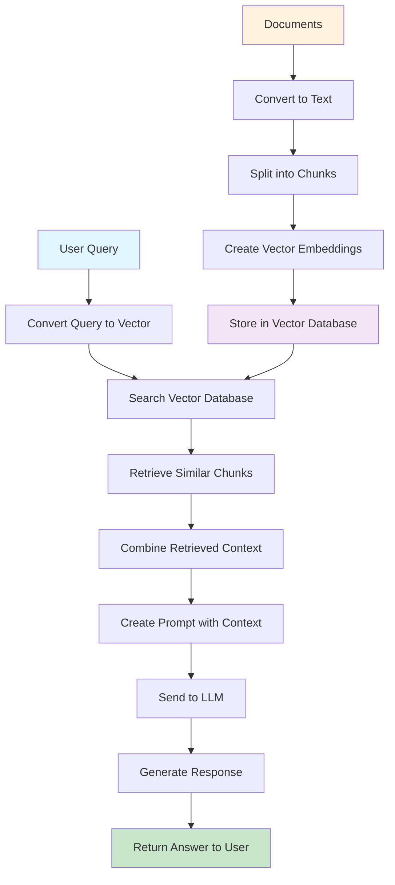

# RAG and Agentic RAG: A 15-Minute Tutorial

## Table of Contents
1. [What is RAG?](#what-is-rag)
2. [Traditional RAG Pipeline](#traditional-rag-pipeline)
3. [Limitations of Traditional RAG](#limitations-of-traditional-rag)
4. [What is Agentic RAG?](#what-is-agentic-rag)
5. [Multi-Agent RAG Architecture](#multi-agent-rag-architecture)
6. [Real-World Implementation: DocChat](#real-world-implementation-docchat)
7. [Key Benefits and Use Cases](#key-benefits-and-use-cases)
8. [Summary](#summary)

---

## What is RAG?

**Retrieval-Augmented Generation (RAG)** is a powerful AI technique that enhances Large Language Models (LLMs) by incorporating relevant information from external knowledge sources.

### The Problem RAG Solves
- **LLMs have limited knowledge** - They only know what they were trained on
- **Knowledge cutoff** - Training data has a specific date, missing recent information
- **Hallucination** - LLMs can generate plausible but incorrect information
- **Lack of grounding** - Responses aren't based on specific, verifiable sources

### How RAG Works
RAG combines two main components:
1. **Retrieval** - Find relevant information from a knowledge base
2. **Generation** - Use that information to generate accurate responses

---

## Traditional RAG Pipeline

### Step-by-Step Process



1. **Document Processing**
   - Convert documents to text
   - Split into chunks
   - Create vector embeddings
   - Store in vector database

2. **Query Processing**
   - User asks a question
   - Convert query to vector embedding
   - Search for similar chunks in database

3. **Response Generation**
   - Combine retrieved context with user query
   - Send to LLM for response generation
   - Return answer to user

### Example Implementation
```python
# Simplified RAG pipeline
def simple_rag(query, retriever, llm):
    # 1. Retrieve relevant documents
    docs = retriever.invoke(query)
    
    # 2. Combine context
    context = "\n".join([doc.page_content for doc in docs])
    prompt = f"Context: {context}\n\nQuestion: {query}\nAnswer:"
    
    # 3. Generate response
    response = llm.invoke(prompt)
    return response
```

---

## Limitations of Traditional RAG

### 1. **Single-Pass Processing**
- Only calls LLM once for response generation
- No verification or refinement
- Limited decision-making capabilities

### 2. **Context Overload**
- All retrieved information sent to LLM at once
- No intelligent filtering or prioritization
- Can lead to irrelevant information inclusion

### 3. **No Quality Control**
- No fact-checking against source documents
- No verification of response accuracy
- Prone to hallucinations and unsupported claims

### 4. **Limited Adaptability**
- Fixed retrieval strategy
- No dynamic query processing
- Cannot handle complex, multi-step queries

### 5. **Poor Error Handling**
- No fallback mechanisms
- Limited debugging capabilities
- Difficult to trace where errors occur

---

## What is Agentic RAG?

**Agentic RAG** extends traditional RAG by using LLMs as intelligent agents that can make decisions, use tools, and collaborate to solve complex tasks.

### Key Differences from Traditional RAG

| Traditional RAG | Agentic RAG |
|----------------|-------------|
| Single LLM call | Multiple specialized agents |
| Fixed pipeline | Dynamic workflow |
| No verification | Built-in fact-checking |
| Limited reasoning | Multi-step reasoning |
| Static retrieval | Adaptive retrieval |

### Core Principles

1. **Agent Specialization** - Each agent has a specific role
2. **Collaborative Workflow** - Agents work together to solve problems
3. **Dynamic Decision Making** - Agents can adapt based on context
4. **Quality Assurance** - Built-in verification and correction mechanisms

---

## Multi-Agent RAG Architecture

### Agent Types and Roles

#### 1. **Relevance Checker Agent**
- **Purpose**: Determines if a query can be answered with available documents
- **Output**: CAN_ANSWER, PARTIAL, or NO_MATCH
- **Benefits**: Prevents hallucination by identifying out-of-scope queries

```python
class RelevanceChecker:
    def check(self, question: str, retriever) -> str:
        # Retrieve top documents
        top_docs = retriever.invoke(question)
        
        # Analyze relevance
        prompt = f"""
        Analyze if the documents can answer: {question}
        Respond with: CAN_ANSWER, PARTIAL, or NO_MATCH
        """
        
        return self.llm.invoke(prompt)
```

#### 2. **Research Agent**
- **Purpose**: Generates initial answers based on retrieved documents
- **Process**: Analyzes context and creates draft response
- **Focus**: Factual accuracy and completeness

```python
class ResearchAgent:
    def research(self, question: str, documents: List[Document]) -> Dict:
        # Combine document content
        context = "\n".join([doc.page_content for doc in documents])
        
        # Generate answer
        prompt = f"""
        Answer this question using only the provided context:
        Question: {question}
        Context: {context}
        """
        
        draft_answer = self.llm.invoke(prompt)
        return {"draft_answer": draft_answer, "context_used": context}
```

#### 3. **Verification Agent**
- **Purpose**: Fact-checks generated answers against source documents
- **Process**: Cross-references claims with original sources
- **Output**: Verification report with supported/unsupported claims

```python
class VerificationAgent:
    def verify(self, answer: str, documents: List[Document]) -> Dict:
        context = "\n".join([doc.page_content for doc in documents])
        
        prompt = f"""
        Verify this answer against the context:
        Answer: {answer}
        Context: {context}
        
        Check for:
        - Direct/indirect factual support (YES/NO)
        - Unsupported claims
        - Contradictions
        - Relevance to question
        """
        
        verification = self.llm.invoke(prompt)
        return self.parse_verification(verification)
```

### Workflow Orchestration with LangGraph

```python
from langgraph.graph import StateGraph, END

class AgentWorkflow:
    def _build_workflow(self):
        workflow = StateGraph(AgentState)
        
        # Add agent nodes
        workflow.add_node("check_relevance", self._check_relevance_step)
        workflow.add_node("research", self._research_step)
        workflow.add_node("verify", self._verification_step)
        
        # Define flow
        workflow.set_entry_point("check_relevance")
        
        workflow.add_conditional_edges(
            "check_relevance",
            self._decide_after_relevance_check,
            {"relevant": "research", "irrelevant": END}
        )
        
        workflow.add_edge("research", "verify")
        
        workflow.add_conditional_edges(
            "verify",
            self._decide_next_step,
            {"re_research": "research", "end": END}
        )
        
        return workflow.compile()
```

---

## Real-World Implementation: DocChat

### System Overview
DocChat is a multi-agent RAG system designed for document analysis with fact-checking capabilities.

### Architecture Components

#### 1. **Document Processing**
- **Docling**: Advanced document parsing for PDFs, DOCX, TXT, MD
- **Chunking**: Intelligent text splitting based on headers and structure
- **Caching**: Efficient processing with result caching

#### 2. **Hybrid Retrieval**
- **BM25**: Keyword-based search for exact matches
- **Vector Search**: Semantic similarity using embeddings
- **ChromaDB**: Vector database for storage and retrieval
- **Ensemble Method**: Combines both approaches for better results

#### 3. **Multi-Agent Workflow**
```python
# State management
class AgentState(TypedDict):
    question: str
    retriever: Any
    documents: List[Document]
    relevance_result: str
    draft_answer: str
    context_used: str
    verification_result: Dict[str, Any]
    final_answer: str
    verification_report: str
    iteration_count: int
    max_iterations: int
```

### Workflow Steps

1. **Query Processing & Relevance Analysis**
   - User submits question
   - Relevance checker determines if question can be answered
   - Route to research or inform user if out of scope

2. **Multi-Agent Research & Document Retrieval**
   - Hybrid retriever finds relevant document sections
   - Research agent generates initial answer
   - Dynamic query processing for complex questions

3. **Answer Generation & Verification Loop**
   - Verification agent fact-checks the answer
   - Self-correction mechanism refines if needed
   - Iterative improvement until satisfactory result

4. **Response Finalization**
   - Return verified answer with source citations
   - Provide verification report
   - Include confidence metrics

### Key Features

- **Fact Verification**: Cross-checks responses against source documents
- **Hallucination Prevention**: Ensures answers are grounded in provided content
- **Self-Correction**: Automatically refines answers when verification fails
- **Multi-Document Support**: Handles complex queries across multiple documents
- **User-Friendly Interface**: Clean Gradio-based web interface

---

## Key Benefits and Use Cases

### Benefits of Agentic RAG

1. **Improved Accuracy**
   - Built-in fact-checking and verification
   - Reduced hallucination through multi-agent validation
   - Source-grounded responses

2. **Enhanced Reliability**
   - Self-correction mechanisms
   - Iterative improvement
   - Quality assurance at each step

3. **Better Scalability**
   - Modular agent design
   - Easy to add new capabilities
   - Parallel processing capabilities

4. **Increased Transparency**
   - Clear verification reports
   - Source citations
   - Confidence metrics

### Real-World Use Cases

#### 1. **Document Analysis**
- Legal contract review
- Research paper analysis
- Technical documentation queries
- Compliance checking

#### 2. **Customer Support**
- Knowledge base queries
- Technical troubleshooting
- Product information retrieval
- FAQ generation

#### 3. **Research and Analysis**
- Market research reports
- Competitive analysis
- Data interpretation
- Trend analysis

#### 4. **Content Creation**
- Fact-checked article writing
- Technical documentation
- Educational content
- Report generation

### Industry Applications

- **Healthcare**: Medical document analysis, patient record queries
- **Finance**: Regulatory compliance, risk assessment
- **Legal**: Contract analysis, case law research
- **Education**: Research assistance, content verification
- **Technology**: Code documentation, API reference

---

## Summary

### Traditional RAG vs Agentic RAG

| Aspect | Traditional RAG | Agentic RAG |
|--------|----------------|-------------|
| **Architecture** | Single pipeline | Multi-agent system |
| **Processing** | One-pass | Iterative with verification |
| **Quality Control** | None | Built-in fact-checking |
| **Adaptability** | Fixed | Dynamic and flexible |
| **Reliability** | Moderate | High with verification |
| **Complexity** | Simple | More complex but powerful |

### Key Takeaways

1. **RAG enhances LLMs** by grounding them in external knowledge
2. **Agentic RAG goes further** by using multiple specialized agents
3. **Multi-agent systems** provide better accuracy, reliability, and transparency
4. **Real-world applications** span across industries and use cases
5. **Implementation** requires careful design of agent roles and workflows

### Next Steps

- Explore the DocChat implementation in this repository
- Experiment with different agent configurations
- Consider your specific use case requirements
- Start with simple multi-agent workflows and iterate

---

**Time to Complete: ~15 minutes**

This tutorial provides a comprehensive overview of RAG and Agentic RAG concepts, their implementations, and real-world applications. The DocChat system in this repository serves as a practical example of how these concepts can be implemented effectively.
